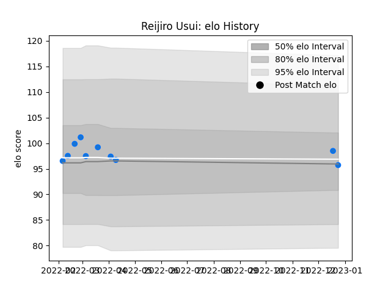

---  
layout: page  
title: Reijiro Usui  
date: 2023-03-09 10:08:53.894060  
categories: player  
---
# Reijiro Usui

## Positions: SH

## Current elo: 96.0

## Current Percentile: 60.0

# Elo History

# Match History

| Team                |   Appearances |   Win Rate |
|:--------------------|--------------:|-----------:|
| Shimizu Blue Sharks |            11 |   0.454545 |

| Opponent                         |   Matches |   Win Rate |
|:---------------------------------|----------:|-----------:|
| Toyota Industries Shuttles Aichi |         3 |        0   |
| Chugoku Red Regulions            |         2 |        1   |
| Munakata Sanix Blues             |         2 |        0.5 |
| Urayasu D-Rocks                  |         2 |        0   |
| Kurita Water Gush                |         1 |        1   |
| Kyuden Voltex                    |         1 |        1   |