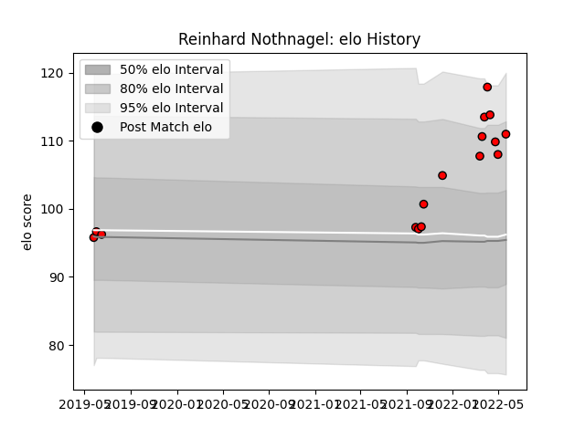

---  
layout: page  
title: Reinhard Nothnagel  
date: 2022-12-09 13:24:38.284613  
categories: player  
---
# Reinhard Nothnagel

## Positions: L

## Current elo: 111.0

## Current Percentile: None

# Elo History

# Match History

| Team   |   Appearances |   Win Rate |
|:-------|--------------:|-----------:|
| Lions  |            16 |     0.5625 |

| Opponent         |   Matches |   Win Rate |
|:-----------------|----------:|-----------:|
| Sharks           |         2 |          0 |
| Stormers         |         2 |          1 |
| Benetton Treviso |         1 |          1 |
| Bulls            |         1 |          0 |
| Cardiff Blues    |         1 |          1 |
| Connacht         |         1 |          0 |
| Dragons          |         1 |          1 |
| Edinburgh        |         1 |          1 |
| Glasgow Warriors |         1 |          0 |
| Munster          |         1 |          1 |
| Ospreys          |         1 |          1 |
| Scarlets         |         1 |          0 |
| Ulster           |         1 |          0 |
| Zebre            |         1 |          1 |