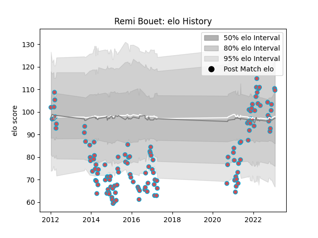

---  
layout: page  
title: Remi Bouet  
date: 2023-01-23 15:35:29.537040  
categories: player  
---
# Remi Bouet

## Positions: W, FB

## Current elo: 110.0

## Current Percentile: 69.0

# Elo History

# Match History

| Team             |   Appearances |   Win Rate |
|:-----------------|--------------:|-----------:|
| Bourgoin-Jallieu |           129 |   0.352713 |

| Opponent                   |   Matches |   Win Rate |
|:---------------------------|----------:|-----------:|
| Dax                        |        10 |   0.4      |
| Tarbes                     |         9 |   0.444444 |
| Beziers                    |         9 |   0.333333 |
| Albi                       |         8 |   0.125    |
| Narbonne                   |         7 |   0.357143 |
| Aurillac                   |         7 |   0.214286 |
| Mont-de-Marsan             |         6 |   0.5      |
| Nice                       |         6 |   0.5      |
| Colomiers                  |         6 |   0.333333 |
| Perpignan                  |         6 |   0.166667 |
| Carcassonne                |         5 |   0.2      |
| Chambery                   |         5 |   0.6      |
| Massy                      |         5 |   0.4      |
| Montauban                  |         4 |   0.25     |
| Soyaux-Angouleme           |         4 |   0        |
| Dijon                      |         4 |   0.75     |
| Cognac Saint Jean d'Angély |         3 |   1        |
| Suresnes                   |         3 |   0.333333 |
| US Bressane                |         3 |   0.333333 |
| Pau                        |         2 |   0        |
| Agen                       |         2 |   0        |
| Valence Romans Drome Rugby |         2 |   0.75     |
| La Rochelle                |         2 |   0        |
| Blagnac                    |         2 |   0.5      |
| Auch                       |         2 |   0        |
| Oyonnax                    |         1 |   1        |
| Grenoble                   |         1 |   0        |
| Provence Rugby             |         1 |   0        |
| Périgueux                  |         1 |   1        |
| Biarritz Olympique         |         1 |   0        |
| Bayonne                    |         1 |   0        |
| Lyon                       |         1 |   1        |