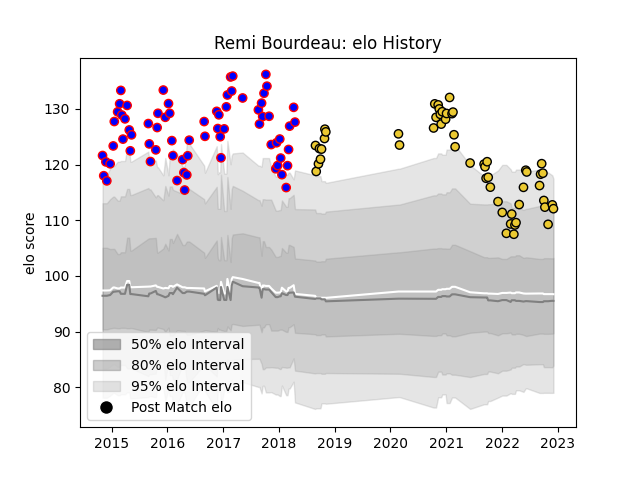

---  
layout: page  
title: Remi Bourdeau  
date: 2022-12-09 13:06:03.189778  
categories: player  
---
# Remi Bourdeau

## Positions: FL, N8

## Current elo: 112.0

## Current Percentile: 90.0

# Elo History

# Match History

| Team        |   Appearances |   Win Rate |
|:------------|--------------:|-----------:|
| Beziers     |            71 |   0.605634 |
| La Rochelle |            54 |   0.611111 |

| Opponent             |   Matches |   Win Rate |
|:---------------------|----------:|-----------:|
| Perpignan            |         9 |   0.666667 |
| Bayonne              |         6 |   0.666667 |
| Biarritz Olympique   |         6 |   0.333333 |
| Racing 92            |         6 |   0.5      |
| Lyon                 |         6 |   0.5      |
| Dax                  |         5 |   0.6      |
| Narbonne             |         5 |   0.8      |
| Montpellier Herault  |         5 |   0.4      |
| Stade Francais Paris |         5 |   0.4      |
| Clermont Auvergne    |         5 |   0.4      |
| Bourgoin-Jallieu     |         5 |   0.8      |
| Aurillac             |         5 |   0.6      |
| Colomiers            |         4 |   0.75     |
| Carcassonne          |         4 |   1        |
| Montauban            |         4 |   0.75     |
| Toulon               |         4 |   0.75     |
| Pau                  |         3 |   0.333333 |
| Stade Toulousain     |         3 |   0        |
| Tarbes               |         3 |   0.333333 |
| Soyaux-Angouleme     |         3 |   0.333333 |
| Agen                 |         3 |   1        |
| Vannes               |         3 |   0.333333 |
| Massy                |         3 |   0.666667 |
| Grenoble             |         3 |   0.666667 |
| Castres Olympique    |         3 |   0.666667 |
| Brive                |         3 |   1        |
| Bordeaux Begles      |         3 |   0.666667 |
| Nevers               |         2 |   1        |
| Mont-de-Marsan       |         2 |   0.5      |
| Oyonnax              |         1 |   1        |
| Provence Rugby       |         1 |   1        |
| RC Enisei            |         1 |   1        |
| Albi                 |         1 |   1        |