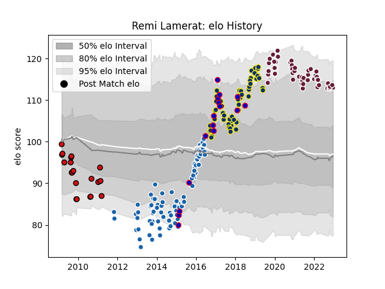

---  
layout: page  
title: Remi Lamerat  
date: 2022-12-18 16:21:35.230939  
categories: player  
---
# Remi Lamerat

## Positions: C

## Country: France

## Current elo: 113.0

## Current Percentile: 88.0

# Elo History

# Match History

| Team              |   Appearances |   Win Rate |
|:------------------|--------------:|-----------:|
| Castres Olympique |            83 |   0.493976 |
| Clermont Auvergne |            53 |   0.688679 |
| Bordeaux Begles   |            48 |   0.614583 |
| Stade Toulousain  |            20 |   0.65     |
| France            |            16 |   0.375    |

| Opponent             |   Matches |   Win Rate |
|:---------------------|----------:|-----------:|
| Racing 92            |        16 |   0.5625   |
| Toulon               |        15 |   0.533333 |
| Castres Olympique    |        13 |   0.653846 |
| Stade Toulousain     |        13 |   0.346154 |
| Stade Francais Paris |        12 |   0.5      |
| Brive                |        11 |   0.727273 |
| La Rochelle          |        11 |   0.636364 |
| Clermont Auvergne    |        10 |   0.5      |
| Pau                  |        10 |   0.7      |
| Montpellier Herault  |        10 |   0.65     |
| Bordeaux Begles      |        10 |   0.8      |
| Bayonne              |         7 |   0.714286 |
| Northampton Saints   |         7 |   0.571429 |
| Grenoble             |         7 |   0.714286 |
| Biarritz Olympique   |         6 |   0.583333 |
| Agen                 |         6 |   0.833333 |
| Oyonnax              |         5 |   0.6      |
| Lyon                 |         5 |   0.4      |
| Ospreys              |         3 |   0.666667 |
| Ulster               |         3 |   0.333333 |
| Ireland              |         3 |   0        |
| Perpignan            |         3 |   0        |
| Scotland             |         3 |   0.666667 |
| Montauban            |         3 |   1        |
| Leinster             |         3 |   0.333333 |
| New Zealand          |         2 |   0        |
| Glasgow Warriors     |         2 |   1        |
| Dragons              |         2 |   0.5      |
| Exeter Chiefs        |         2 |   1        |
| England              |         2 |   0        |
| Wales                |         2 |   0.5      |
| Sale Sharks          |         2 |   0        |
| Wasps                |         2 |   0.5      |
| Argentina            |         1 |   1        |
| Australia            |         1 |   0        |
| Italy                |         1 |   1        |
| Sharks               |         1 |   0        |
| Saracens             |         1 |   0        |
| Samoa                |         1 |   1        |
| Harlequins           |         1 |   0        |
| Albi                 |         1 |   1        |
| Edinburgh            |         1 |   1        |