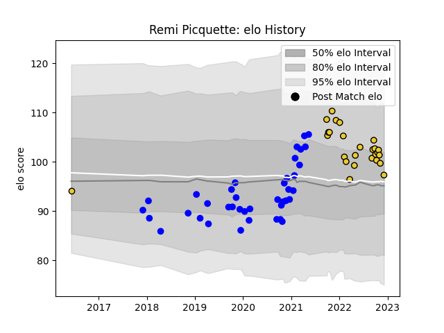

---  
layout: page  
title: Remi Picquette  
date: 2022-12-09 13:18:16.424084  
categories: player  
---
# Remi Picquette

## Positions: L

## Current elo: 97.0

## Current Percentile: 67.0

# Elo History

# Match History

| Team        |   Appearances |   Win Rate |
|:------------|--------------:|-----------:|
| Vannes      |            39 |   0.628205 |
| La Rochelle |            26 |   0.5      |

| Opponent             |   Matches |   Win Rate |
|:---------------------|----------:|-----------:|
| Mont-de-Marsan       |         5 |   0.8      |
| Biarritz Olympique   |         5 |   0.4      |
| Perpignan            |         4 |   0.5      |
| Aurillac             |         4 |   0.75     |
| Montpellier Herault  |         3 |   0.333333 |
| Clermont Auvergne    |         3 |   0.333333 |
| Rouen                |         3 |   0.666667 |
| Grenoble             |         3 |   0.666667 |
| Provence Rugby       |         3 |   0.666667 |
| Brive                |         2 |   1        |
| Stade Toulousain     |         2 |   0        |
| Stade Francais Paris |         2 |   0        |
| Soyaux-Angouleme     |         2 |   1        |
| Beziers              |         2 |   1        |
| Nevers               |         2 |   0.5      |
| Toulon               |         2 |   0.5      |
| Montauban            |         2 |   1        |
| Lyon                 |         2 |   1        |
| Colomiers            |         2 |   0.5      |
| Castres Olympique    |         2 |   0.5      |
| Carcassonne          |         2 |   0.25     |
| Narbonne             |         1 |   0        |
| Bayonne              |         1 |   0        |
| Oyonnax              |         1 |   1        |
| Pau                  |         1 |   0        |
| Massy                |         1 |   1        |
| Racing 92            |         1 |   1        |
| Dax                  |         1 |   0        |
| Bordeaux Begles      |         1 |   1        |