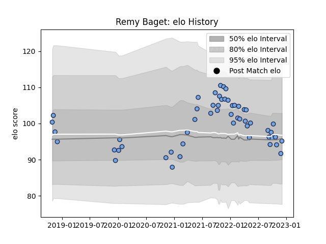

---  
layout: page  
title: Remy Baget  
date: 2022-12-09 13:12:32.079993  
categories: player  
---
# Remy Baget

## Positions: W

## Current elo: 95.0

## Current Percentile: 33.0

# Elo History

# Match History

| Team    |   Appearances |   Win Rate |
|:--------|--------------:|-----------:|
| Bayonne |            53 |   0.566038 |

| Opponent             |   Matches |   Win Rate |
|:---------------------|----------:|-----------:|
| Agen                 |         3 |   0.5      |
| Beziers              |         3 |   0.333333 |
| Bordeaux Begles      |         3 |   0.333333 |
| Vannes               |         3 |   1        |
| Montauban            |         2 |   1        |
| US Bressane          |         2 |   1        |
| Toulon               |         2 |   0.5      |
| Stade Toulousain     |         2 |   1        |
| Stade Francais Paris |         2 |   0        |
| Scarlets             |         2 |   0        |
| Rouen                |         2 |   1        |
| Racing 92            |         2 |   1        |
| Provence Rugby       |         2 |   0.5      |
| Montpellier Herault  |         2 |   0        |
| Mont-de-Marsan       |         2 |   0        |
| Carcassonne          |         2 |   0.5      |
| Colomiers            |         2 |   0.5      |
| Grenoble             |         2 |   0.5      |
| La Rochelle          |         1 |   1        |
| Brive                |         1 |   0        |
| Castres Olympique    |         1 |   0        |
| Soyaux-Angouleme     |         1 |   1        |
| Leicester Tigers     |         1 |   0        |
| Aurillac             |         1 |   1        |
| London Irish         |         1 |   1        |
| Lyon                 |         1 |   1        |
| Perpignan            |         1 |   1        |
| Oyonnax              |         1 |   0        |
| Nevers               |         1 |   1        |
| Narbonne             |         1 |   1        |
| Zebre                |         1 |   0.5      |