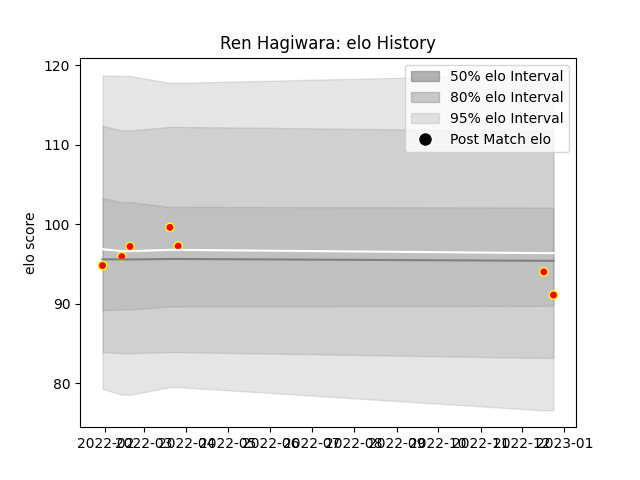

---  
layout: page  
title: Ren Hagiwara  
date: 2022-12-28 12:55:52.899800  
categories: player  
---
# Ren Hagiwara

## Positions: W

## Current elo: 91.0

## Current Percentile: 44.0

# Elo History

# Match History

| Team          |   Appearances |   Win Rate |
|:--------------|--------------:|-----------:|
| Kyuden Voltex |             7 |   0.285714 |

| Opponent                         |   Matches |   Win Rate |
|:---------------------------------|----------:|-----------:|
| Munakata Sanix Blues             |         2 |          0 |
| Toyota Industries Shuttles Aichi |         2 |          0 |
| Chugoku Red Regulions            |         1 |          1 |
| Kurita Water Gush                |         1 |          1 |
| NTT Docomo Red Hurricanes Osaka  |         1 |          0 |