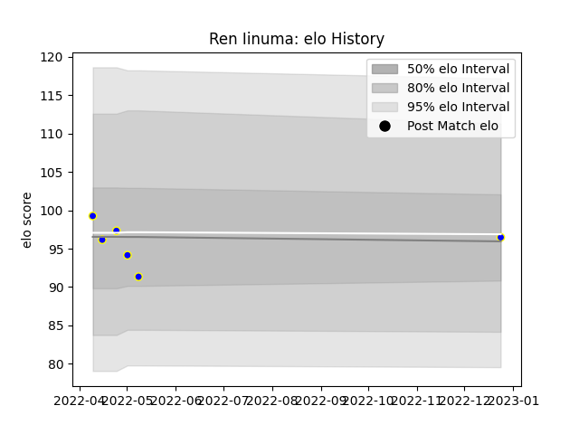

---  
layout: page  
title: Ren Iinuma  
date: 2023-03-21 18:04:24.025445  
categories: player  
---
# Ren Iinuma

Last updated: 2023-03-21
## Positions: SH

## Current elo: 117.0

## Current Percentile: 92.0

# Elo History

# Match History

| Team            |   Appearances |   Win Rate |
|:----------------|--------------:|-----------:|
| Urayasu D-Rocks |            13 |   0.615385 |

| Opponent                          |   Matches |   Win Rate |
|:----------------------------------|----------:|-----------:|
| Kamaishi Seawaves                 |         2 |          1 |
| Shimizu Blue Sharks               |         2 |          1 |
| Toyota Industries Shuttles Aichi  |         2 |          1 |
| Green Rockets Tokatsu             |         1 |          1 |
| Hino Red Dolphins                 |         1 |          1 |
| Kobelco Kobe Steelers             |         1 |          0 |
| Kubota Spears Funabashi Tokyo-Bay |         1 |          0 |
| Mitsubishi Dynaboars              |         1 |          0 |
| Saitama Wild Knights              |         1 |          0 |
| Yokohama Canon Eagles             |         1 |          0 |