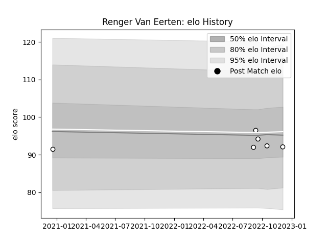

---  
layout: page  
title: Renger Van Eerten  
date: 2022-12-18 16:25:49.433101  
categories: player  
---
# Renger Van Eerten

## Positions: L

## Current elo: 85.0

## Current Percentile: 22.0

# Elo History

# Match History

| Team   |   Appearances |   Win Rate |
|:-------|--------------:|-----------:|
| Brive  |             8 |      0.125 |

| Opponent            |   Matches |   Win Rate |
|:--------------------|----------:|-----------:|
| Bordeaux Begles     |         1 |          0 |
| Cardiff Blues       |         1 |          0 |
| Connacht            |         1 |          0 |
| Lyon                |         1 |          0 |
| Montpellier Herault |         1 |          0 |
| Perpignan           |         1 |          1 |
| Stade Toulousain    |         1 |          0 |
| Zebre               |         1 |          0 |