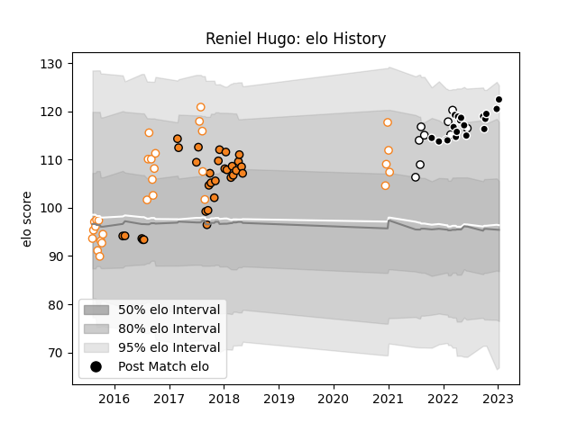

---  
layout: page  
title: Reniel Hugo  
date: 2022-12-28 12:57:05.837100  
categories: player  
---
# Reniel Hugo

## Positions: L

## Current elo: 112.0

## Current Percentile: 85.0

# Elo History

# Match History

| Team                |   Appearances |   Win Rate |
|:--------------------|--------------:|-----------:|
| Cheetahs            |            30 |   0.533333 |
| Free State Cheetahs |            29 |   0.655172 |
| Sharks              |            18 |   0.694444 |
| Natal Sharks        |             9 |   0.555556 |

| Opponent               |   Matches |   Win Rate |
|:-----------------------|----------:|-----------:|
| Western Province       |         9 |   0.444444 |
| Golden Lions           |         6 |   0.5      |
| Griquas                |         6 |   0.666667 |
| Pumas                  |         5 |   0.9      |
| Zebre                  |         4 |   1        |
| Bulls                  |         4 |   0.5      |
| Southern Kings         |         4 |   1        |
| Natal Sharks           |         4 |   0.875    |
| Lions                  |         4 |   0.75     |
| Blue Bulls             |         4 |   0.5      |
| Scarlets               |         3 |   0.666667 |
| Leinster               |         3 |   0.666667 |
| Glasgow Warriors       |         3 |   0.333333 |
| Dragons                |         3 |   1        |
| Connacht               |         3 |   0.666667 |
| Edinburgh              |         2 |   0.5      |
| Munster                |         2 |   0        |
| Eastern Province Kings |         2 |   0.5      |
| Ospreys                |         2 |   0.5      |
| Cardiff Blues          |         2 |   0.5      |
| Stormers               |         2 |   0.25     |
| Ulster                 |         2 |   0        |
| Free State Cheetahs    |         1 |   1        |
| Jaguares               |         1 |   0        |
| Sharks                 |         1 |   0        |
| Sunwolves              |         1 |   1        |
| Western Force          |         1 |   1        |
| Boland Cavaliers       |         1 |   1        |
| Benetton Treviso       |         1 |   0        |