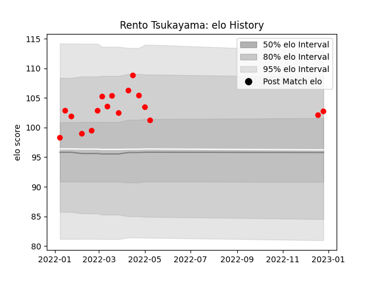

---  
layout: page  
title: Rento Tsukayama  
date: 2022-12-28 12:57:15.479002  
categories: player  
---
# Rento Tsukayama

## Positions: P

## Current elo: 103.0

## Current Percentile: 73.0

# Elo History

# Match History

| Team                  |   Appearances |   Win Rate |
|:----------------------|--------------:|-----------:|
| Yokohama Canon Eagles |            17 |   0.617647 |

| Opponent                          |   Matches |   Win Rate |
|:----------------------------------|----------:|-----------:|
| Kobelco Kobe Steelers             |         3 |   0.666667 |
| Kubota Spears Funabashi Tokyo-Bay |         3 |   0.5      |
| Green Rockets Tokatsu             |         2 |   1        |
| Saitama Wild Knights              |         2 |   0        |
| Black Rams Tokyo                  |         1 |   1        |
| NTT Docomo Red Hurricanes Osaka   |         1 |   1        |
| Shizuoka Blue Revs                |         1 |   1        |
| Tokyo Sungoliath                  |         1 |   0        |
| Toshiba Brave Lupus Tokyo         |         1 |   0        |
| Toyota Verblitz                   |         1 |   1        |
| Urayasu D-Rocks                   |         1 |   1        |