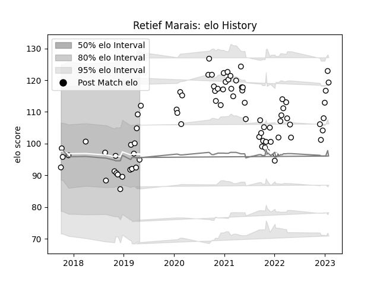

---  
layout: page  
title: Retief Marais  
date: 2022-12-09 13:19:57.957730  
categories: player  
---
# Retief Marais

## Positions: FL

## Current elo: 94.0

## Current Percentile: 50.0

# Elo History

# Match History

| Team   |   Appearances |   Win Rate |
|:-------|--------------:|-----------:|
| Brive  |            73 |   0.438356 |

| Opponent             |   Matches |   Win Rate |
|:---------------------|----------:|-----------:|
| Pau                  |         6 |   0.666667 |
| Bordeaux Begles      |         6 |   0.25     |
| Castres Olympique    |         5 |   0.6      |
| Lyon                 |         5 |   0.4      |
| Montpellier Herault  |         5 |   0.3      |
| Bayonne              |         4 |   0.5      |
| Toulon               |         4 |   0.5      |
| Clermont Auvergne    |         4 |   0.25     |
| Agen                 |         3 |   0.666667 |
| Stade Toulousain     |         3 |   0        |
| Stade Francais Paris |         3 |   0.666667 |
| La Rochelle          |         3 |   0.333333 |
| Racing 92            |         3 |   0.333333 |
| Provence Rugby       |         2 |   0.5      |
| Nevers               |         2 |   1        |
| Montauban            |         2 |   0.5      |
| Colomiers            |         2 |   0.5      |
| Carcassonne          |         2 |   0.5      |
| Biarritz Olympique   |         2 |   0.5      |
| Oyonnax              |         1 |   1        |
| Newcastle Falcons    |         1 |   0        |
| Perpignan            |         1 |   0        |
| Aurillac             |         1 |   0        |
| US Bressane          |         1 |   0        |
| Vannes               |         1 |   1        |
| Worcester Warriors   |         1 |   0        |