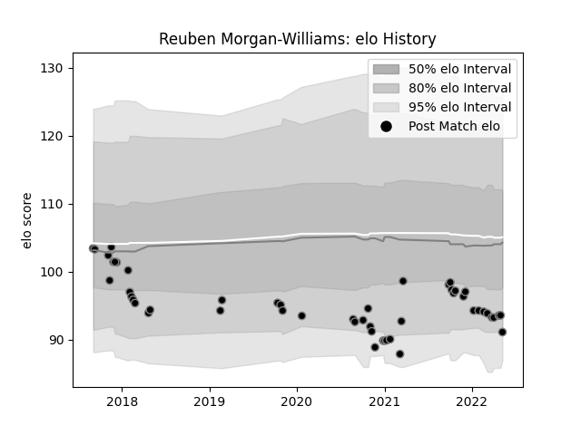

---  
layout: page  
title: Reuben Morgan-Williams  
date: 2023-01-06 00:14:36.739839  
categories: player  
---
# Reuben Morgan-Williams

## Positions: SH

## Current elo: 91.0

## Current Percentile: 15.0

# Elo History

# Match History

| Team    |   Appearances |   Win Rate |
|:--------|--------------:|-----------:|
| Ospreys |            51 |   0.480392 |

| Opponent           |   Matches |   Win Rate |
|:-------------------|----------:|-----------:|
| Cardiff Blues      |         6 |   0.833333 |
| Dragons            |         5 |   0.7      |
| Glasgow Warriors   |         5 |   0.2      |
| Munster            |         5 |   0.2      |
| Zebre              |         4 |   0.5      |
| Connacht           |         4 |   0.25     |
| Edinburgh          |         3 |   0.666667 |
| Leinster           |         3 |   0.333333 |
| Benetton Treviso   |         3 |   1        |
| Ulster             |         2 |   0.5      |
| Scarlets           |         2 |   0.5      |
| Southern Kings     |         1 |   1        |
| Wasps              |         1 |   0        |
| Stormers           |         1 |   0        |
| Bath Rugby         |         1 |   0        |
| Sharks             |         1 |   0        |
| Northampton Saints |         1 |   1        |
| Gloucester Rugby   |         1 |   0        |
| Cheetahs           |         1 |   1        |
| Lions              |         1 |   0        |