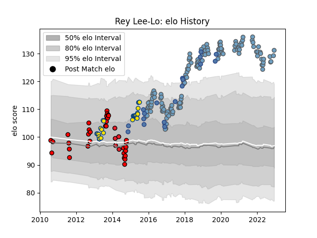

---  
layout: page  
title: Rey Lee-Lo  
date: 2022-12-18 16:26:49.159514  
categories: player  
---
# Rey Lee-Lo

## Positions: C

## Country: Samoa

## Current elo: 133.0

## Current Percentile: 99.0

# Elo History

# Match History

| Team             |   Appearances |   Win Rate |
|:-----------------|--------------:|-----------:|
| Cardiff Blues    |           141 |   0.535461 |
| Counties Manukau |            33 |   0.590909 |
| Hurricanes       |            28 |   0.607143 |
| Samoa            |            18 |   0.25     |
| Crusaders        |             5 |   0.4      |

| Opponent                 |   Matches |   Win Rate |
|:-------------------------|----------:|-----------:|
| Scarlets                 |        14 |   0.5      |
| Dragons                  |        12 |   1        |
| Ospreys                  |        11 |   0.181818 |
| Munster                  |        10 |   0.5      |
| Connacht                 |        10 |   0.5      |
| Glasgow Warriors         |         9 |   0.111111 |
| Edinburgh                |         8 |   0.75     |
| Zebre                    |         7 |   0.857143 |
| Ulster                   |         7 |   0.357143 |
| Benetton Treviso         |         7 |   0.714286 |
| Leinster                 |         6 |   0.166667 |
| Cheetahs                 |         6 |   0.666667 |
| Blues                    |         5 |   0.4      |
| Waikato                  |         5 |   0.2      |
| Chiefs                   |         5 |   0.4      |
| Highlanders              |         4 |   0.5      |
| Wellington               |         4 |   0.5      |
| Lyon                     |         4 |   1        |
| Harlequins               |         4 |   0        |
| Southland                |         3 |   1        |
| Lions                    |         3 |   0.333333 |
| Hawke's Bay              |         3 |   0.333333 |
| Pau                      |         3 |   0.666667 |
| Queensland Reds          |         3 |   0.666667 |
| Sharks                   |         3 |   0.666667 |
| Manawatu                 |         3 |   0.666667 |
| Calvisano                |         3 |   1        |
| Georgia                  |         3 |   0.166667 |
| Bay of Plenty            |         3 |   0.666667 |
| Crusaders                |         3 |   0.333333 |
| Gloucester Rugby         |         2 |   0.5      |
| Western Force            |         2 |   1        |
| Bath Rugby               |         2 |   0.5      |
| United States of America |         2 |   0.5      |
| Bristol Rugby            |         2 |   1        |
| Tasman                   |         2 |   0.5      |
| Taranaki                 |         2 |   0.75     |
| Stormers                 |         2 |   1        |
| Southern Kings           |         2 |   1        |
| Brumbies                 |         2 |   0.5      |
| Scotland                 |         2 |   0        |
| Sale Sharks              |         2 |   0.5      |
| Auckland                 |         2 |   0.5      |
| Leicester Tigers         |         2 |   0        |
| England                  |         2 |   0        |
| Otago                    |         2 |   1        |
| Montpellier Herault      |         2 |   0.5      |
| New South Wales Waratahs |         2 |   0.5      |
| North Harbour            |         2 |   1        |
| Stade Toulousain         |         1 |   1        |
| France                   |         1 |   0        |
| Wales                    |         1 |   0        |
| Australia                |         1 |   0        |
| Newcastle Falcons        |         1 |   1        |
| Canada                   |         1 |   1        |
| Romania                  |         1 |   0        |
| Brive                    |         1 |   1        |
| Northland                |         1 |   1        |
| South Africa             |         1 |   0        |
| Canterbury               |         1 |   0        |
| Bulls                    |         1 |   0        |
| Saracens                 |         1 |   0        |
| Japan                    |         1 |   0        |
| Russia                   |         1 |   1        |
| Spain                    |         1 |   1        |