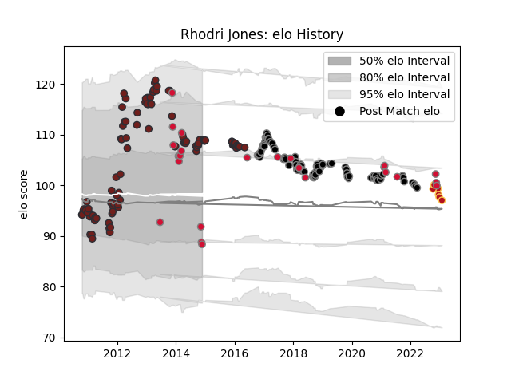

---  
layout: page  
title: Rhodri Jones  
date: 2022-11-15 23:41:32.224397  
categories: player  
---
# Rhodri Jones

## Positions: P

## Country: Wales

## Current elo: 92.0

## Current Percentile: 28.0

# Elo History

# Match History

| Team     |   Appearances |   Win Rate |
|:---------|--------------:|-----------:|
| Scarlets |           103 |   0.5      |
| Ospreys  |            82 |   0.536585 |
| Wales    |            18 |   0.722222 |
| Dragons  |             2 |   0.5      |

| Opponent             |   Matches |   Win Rate |
|:---------------------|----------:|-----------:|
| Cardiff Blues        |        19 |   0.736842 |
| Munster              |        16 |   0.09375  |
| Benetton Treviso     |        16 |   0.6875   |
| Glasgow Warriors     |        13 |   0.461538 |
| Leinster             |        12 |   0.208333 |
| Ulster               |        12 |   0.291667 |
| Edinburgh            |        11 |   0.818182 |
| Connacht             |        10 |   0.7      |
| Zebre                |         9 |   0.777778 |
| Ospreys              |         8 |   0.4375   |
| Dragons              |         8 |   0.875    |
| Cheetahs             |         5 |   0.6      |
| Leicester Tigers     |         5 |   0.6      |
| Northampton Saints   |         4 |   0.25     |
| Scarlets             |         4 |   0.25     |
| England              |         3 |   0.333333 |
| Argentina            |         3 |   0.666667 |
| Scotland             |         2 |   1        |
| Newcastle Falcons    |         2 |   1        |
| Racing 92            |         2 |   0.25     |
| Lyon                 |         2 |   1        |
| South Africa         |         2 |   1        |
| Stade Francais Paris |         2 |   0.5      |
| Italy                |         2 |   1        |
| Ireland              |         2 |   0.5      |
| Southern Kings       |         2 |   0.5      |
| Grenoble             |         2 |   1        |
| Clermont Auvergne    |         2 |   0        |
| Castres Olympique    |         2 |   1        |
| Wasps                |         2 |   0.5      |
| Sale Sharks          |         2 |   0        |
| Saracens             |         1 |   0        |
| Tonga                |         1 |   1        |
| Toulon               |         1 |   0        |
| Worcester Warriors   |         1 |   0        |
| Yorkshire Carnegie   |         1 |   1        |
| Aironi               |         1 |   1        |
| Samoa                |         1 |   1        |
| Perpignan            |         1 |   0        |
| Pau                  |         1 |   1        |
| London Irish         |         1 |   1        |
| Harlequins           |         1 |   0        |
| Gloucester Rugby     |         1 |   0        |
| France               |         1 |   1        |
| Exeter Chiefs        |         1 |   0        |
| Brive                |         1 |   0        |
| Bristol Rugby        |         1 |   1        |
| Bath Rugby           |         1 |   0        |
| Australia            |         1 |   0        |
| Lions                |         1 |   0        |