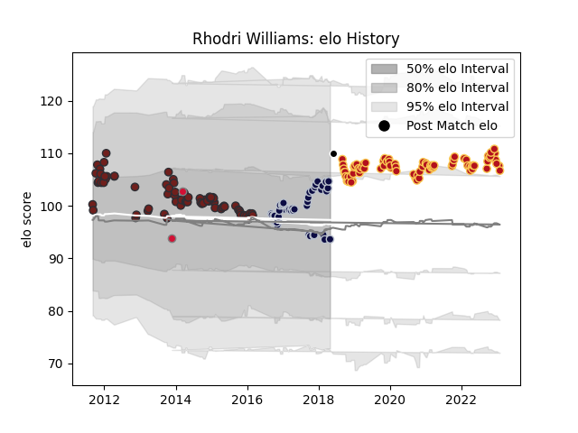

---  
layout: page  
title: Rhodri Williams  
date: 2023-02-02 18:45:43.751387  
categories: player  
---
# Rhodri Williams

## Positions: SH

## Country: Barbarians

## Current elo: 94.0

## Current Percentile: 72.0

# Elo History

# Match History

| Team          |   Appearances |   Win Rate |
|:--------------|--------------:|-----------:|
| Dragons       |            82 |   0.286585 |
| Scarlets      |            78 |   0.596154 |
| Bristol Rugby |            44 |   0.568182 |
| Wales         |             2 |   1        |
| Barbarians    |             1 |   1        |

| Opponent            |   Matches |   Win Rate |
|:--------------------|----------:|-----------:|
| Cardiff Blues       |        14 |   0.285714 |
| Ospreys             |        14 |   0.392857 |
| Zebre               |        12 |   0.708333 |
| Glasgow Warriors    |        12 |   0.5      |
| Edinburgh           |        11 |   0.590909 |
| Ulster              |        11 |   0.318182 |
| Munster             |        10 |   0.4      |
| Leinster            |         9 |   0.111111 |
| Scarlets            |         7 |   0.428571 |
| Benetton Treviso    |         7 |   0.5      |
| Connacht            |         7 |   0.428571 |
| Dragons             |         6 |   1        |
| Worcester Warriors  |         6 |   0.333333 |
| Northampton Saints  |         5 |   0.2      |
| Sale Sharks         |         4 |   0.5      |
| Clermont Auvergne   |         4 |   0        |
| Castres Olympique   |         3 |   0.666667 |
| Harlequins          |         3 |   0.333333 |
| Racing 92           |         3 |   0.5      |
| Leicester Tigers    |         3 |   0.333333 |
| Bath Rugby          |         3 |   0.333333 |
| Sharks              |         2 |   0        |
| Southern Kings      |         2 |   0.75     |
| Saracens            |         2 |   0        |
| Rotherham Titans    |         2 |   1        |
| Pau                 |         2 |   0.5      |
| Stormers            |         2 |   0        |
| Yorkshire Carnegie  |         2 |   1        |
| Nottingham          |         2 |   1        |
| Toulon              |         2 |   0        |
| Aironi              |         2 |   1        |
| Doncaster           |         2 |   1        |
| Ealing Trailfinders |         2 |   1        |
| Bedford             |         2 |   1        |
| Cheetahs            |         2 |   0.5      |
| Cornish Pirates     |         2 |   1        |
| London Scottish     |         2 |   1        |
| Lions               |         2 |   0.25     |
| Gloucester Rugby    |         2 |   0        |
| Hartpury College    |         2 |   1        |
| Jersey              |         2 |   0.5      |
| London Irish        |         2 |   1        |
| Exeter Chiefs       |         1 |   0        |
| England             |         1 |   1        |
| Scotland            |         1 |   1        |
| Richmond            |         1 |   1        |
| Timisoara Saracens  |         1 |   1        |
| Tonga               |         1 |   1        |
| Bulls               |         1 |   0        |
| Brive               |         1 |   0        |
| Wasps               |         1 |   0        |
| Bristol Rugby       |         1 |   0        |
| Newcastle Falcons   |         1 |   0        |