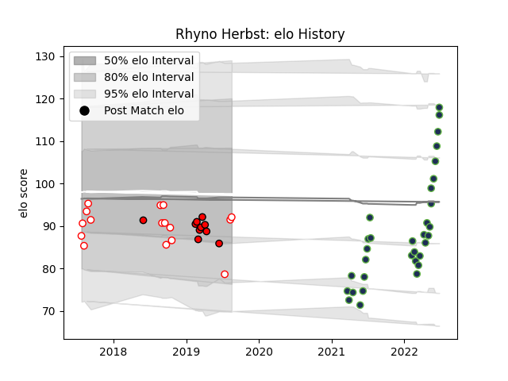

---  
layout: page  
title: Rhyno Herbst  
date: 2023-02-28 11:02:44.409967  
categories: player  
---
# Rhyno Herbst

## Positions: L

## Current elo: 92.0

## Current Percentile: 12.0

# Elo History

# Match History

| Team              |   Appearances |   Win Rate |
|:------------------|--------------:|-----------:|
| Seattle Seawolves |            32 |     0.4375 |
| Golden Lions      |            16 |     0.4375 |
| Lions             |            10 |     0.5    |

| Opponent               |   Matches |   Win Rate |
|:-----------------------|----------:|-----------:|
| Houston SaberCats      |         5 |   0.6      |
| Utah Warriors          |         4 |   0.75     |
| San Diego Legion       |         4 |   0.75     |
| Austin Gilgronis       |         3 |   0        |
| Pumas                  |         3 |   0.666667 |
| Blue Bulls             |         3 |   0.333333 |
| L. A. Giltinis         |         3 |   0.333333 |
| Natal Sharks           |         3 |   0        |
| Griquas                |         3 |   1        |
| Jaguares               |         2 |   1        |
| R.U. New York          |         2 |   0        |
| Toronto Arrows         |         2 |   0.5      |
| Stormers               |         2 |   0.5      |
| Bulls                  |         2 |   0        |
| Rugby New York         |         2 |   0        |
| Western Province       |         2 |   0        |
| Dallas Jackals         |         2 |   1        |
| New England Free Jacks |         2 |   0        |
| Free State Cheetahs    |         2 |   0.5      |
| NOLA Gold              |         2 |   0.5      |
| Sharks                 |         1 |   0        |
| Sunwolves              |         1 |   1        |
| Melbourne Rebels       |         1 |   1        |
| Brumbies               |         1 |   0        |
| Rugby ATL              |         1 |   0        |