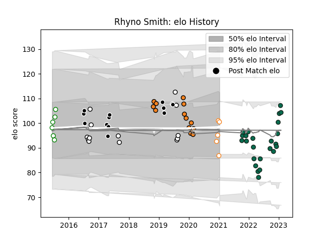

---  
layout: page  
title: Rhyno Smith  
date: 2022-12-18 16:18:35.157128  
categories: player  
---
# Rhyno Smith

## Positions: FB, W

## Current elo: 107.0

## Current Percentile: 71.0

# Elo History

# Match History

| Team                |   Appearances |   Win Rate |
|:--------------------|--------------:|-----------:|
| Benetton Treviso    |            20 |   0.4      |
| Cheetahs            |            14 |   0.357143 |
| Sharks              |            13 |   0.576923 |
| Leopards            |             5 |   0.8      |
| Natal Sharks        |             4 |   0.5      |
| Free State Cheetahs |             2 |   0        |

| Opponent               |   Matches |   Win Rate |
|:-----------------------|----------:|-----------:|
| Glasgow Warriors       |         4 |   0.5      |
| Zebre                  |         3 |   0.666667 |
| Southern Kings         |         3 |   0.666667 |
| Cardiff Blues          |         3 |   0.666667 |
| Scarlets               |         3 |   0.333333 |
| Connacht               |         3 |   0        |
| Jaguares               |         2 |   1        |
| Western Province       |         2 |   0.5      |
| Ulster                 |         2 |   0        |
| Sunwolves              |         2 |   1        |
| Stormers               |         2 |   0.5      |
| Ospreys                |         2 |   0.5      |
| Munster                |         2 |   0        |
| Lions                  |         2 |   0        |
| Leinster               |         2 |   0        |
| Edinburgh              |         2 |   0.5      |
| Bulls                  |         2 |   0        |
| Griquas                |         1 |   0        |
| Sharks                 |         1 |   0        |
| Blue Bulls             |         1 |   0        |
| Western Force          |         1 |   1        |
| Valke                  |         1 |   1        |
| Boland Cavaliers       |         1 |   1        |
| Border Bulldogs        |         1 |   1        |
| Brumbies               |         1 |   0        |
| Cheetahs               |         1 |   1        |
| Golden Lions           |         1 |   0        |
| SWD Eagles             |         1 |   1        |
| Pumas                  |         1 |   0        |
| Dragons                |         1 |   0        |
| Eastern Province Kings |         1 |   1        |
| Melbourne Rebels       |         1 |   0.5      |
| Benetton Treviso       |         1 |   1        |
| Bayonne                |         1 |   1        |