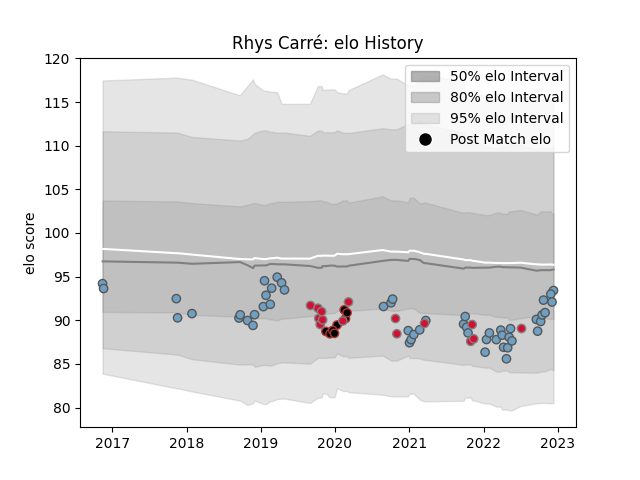

---  
layout: page  
title: Rhys Carré  
date: 2022-12-18 16:30:29.910216  
categories: player  
---
# Rhys Carré

## Positions: P

## Country: Wales

## Current elo: 95.0

## Current Percentile: 39.0

# Elo History

# Match History

| Team          |   Appearances |   Win Rate |
|:--------------|--------------:|-----------:|
| Cardiff Blues |            53 |   0.45283  |
| Wales         |            15 |   0.333333 |
| Saracens      |             8 |   0.5      |

| Opponent           |   Matches |   Win Rate |
|:-------------------|----------:|-----------:|
| Ospreys            |         7 |   0.142857 |
| Scarlets           |         7 |   0.571429 |
| Connacht           |         5 |   0.6      |
| Glasgow Warriors   |         5 |   0.2      |
| Edinburgh          |         4 |   0.5      |
| Munster            |         4 |   0.5      |
| Zebre              |         3 |   0.666667 |
| Dragons            |         3 |   1        |
| South Africa       |         3 |   0        |
| Bulls              |         2 |   0        |
| Newcastle Falcons  |         2 |   0.5      |
| New Zealand        |         2 |   0        |
| Sharks             |         2 |   1        |
| Ireland            |         2 |   0        |
| France             |         2 |   0.5      |
| Fiji               |         2 |   1        |
| Exeter Chiefs      |         2 |   0        |
| Ulster             |         2 |   0        |
| Stormers           |         1 |   1        |
| Racing 92          |         1 |   0        |
| Scotland           |         1 |   0        |
| Wasps              |         1 |   0        |
| Sale Sharks        |         1 |   1        |
| Uruguay            |         1 |   1        |
| Benetton Treviso   |         1 |   0        |
| Northampton Saints |         1 |   1        |
| Lyon               |         1 |   1        |
| Bristol Rugby      |         1 |   1        |
| Leicester Tigers   |         1 |   0        |
| Italy              |         1 |   1        |
| Harlequins         |         1 |   0        |
| England            |         1 |   0        |
| Cheetahs           |         1 |   0        |
| Brive              |         1 |   1        |
| Leinster           |         1 |   1        |