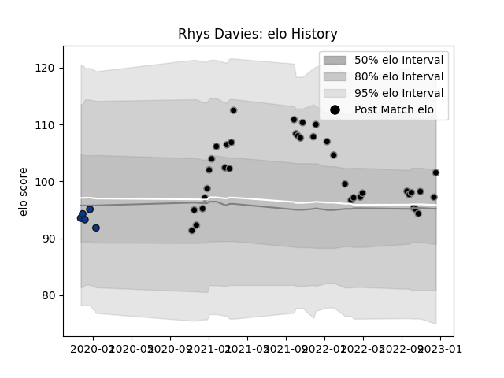

---  
layout: page  
title: Rhys Davies  
date: 2023-01-06 00:10:45.083849  
categories: player  
---
# Rhys Davies

## Positions: L

## Current elo: 116.0

## Current Percentile: 84.0

# Elo History

# Match History

| Team       |   Appearances |   Win Rate |
|:-----------|--------------:|-----------:|
| Ospreys    |            39 |   0.564103 |
| Bath Rugby |             5 |   0.2      |

| Opponent            |   Matches |   Win Rate |
|:--------------------|----------:|-----------:|
| Dragons             |         4 |   0.5      |
| Scarlets            |         4 |   0.625    |
| Cardiff Blues       |         4 |   1        |
| Ulster              |         3 |   0.333333 |
| Connacht            |         3 |   0.333333 |
| Glasgow Warriors    |         3 |   0.333333 |
| Benetton Treviso    |         2 |   1        |
| Leinster            |         2 |   0.5      |
| Stormers            |         2 |   0.25     |
| Munster             |         2 |   0.5      |
| Lions               |         2 |   0        |
| Harlequins          |         2 |   0        |
| Zebre               |         2 |   1        |
| Leicester Tigers    |         1 |   0        |
| London Irish        |         1 |   1        |
| Montpellier Herault |         1 |   1        |
| Saracens            |         1 |   0        |
| Edinburgh           |         1 |   1        |
| Sharks              |         1 |   0        |
| Clermont Auvergne   |         1 |   0        |
| Castres Olympique   |         1 |   1        |
| Worcester Warriors  |         1 |   1        |