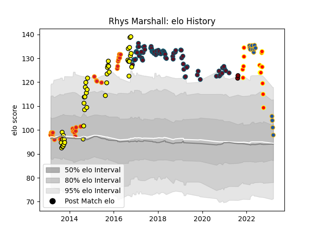

---  
layout: page  
title: Rhys Marshall  
date: 2023-03-17 17:07:47.650852  
categories: player  
---
# Rhys Marshall

## Positions: H

## Current elo: 101.0

## Current Percentile: 82.0

# Elo History

# Match History

| Team          |   Appearances |   Win Rate |
|:--------------|--------------:|-----------:|
| Munster       |            79 |   0.740506 |
| Taranaki      |            41 |   0.609756 |
| Chiefs        |            31 |   0.741935 |
| Waikato       |            16 |   0.78125  |
| Highlanders   |            12 |   0.333333 |
| North Harbour |             2 |   0.5      |

| Opponent                 |   Matches |   Win Rate |
|:-------------------------|----------:|-----------:|
| Tasman                   |         8 |   0.5      |
| Ospreys                  |         8 |   1        |
| Crusaders                |         7 |   0.428571 |
| Cheetahs                 |         7 |   0.785714 |
| Bay of Plenty            |         7 |   0.857143 |
| Glasgow Warriors         |         7 |   0.714286 |
| Canterbury               |         6 |   0.333333 |
| Auckland                 |         5 |   0.8      |
| Wellington               |         5 |   0.4      |
| Waikato                  |         5 |   0.5      |
| Scarlets                 |         5 |   0.4      |
| Racing 92                |         5 |   0.6      |
| Edinburgh                |         5 |   0.8      |
| Leinster                 |         5 |   0.2      |
| Counties Manukau         |         5 |   0.7      |
| Connacht                 |         5 |   0.8      |
| Benetton Treviso         |         5 |   1        |
| Hurricanes               |         4 |   0.5      |
| Blues                    |         4 |   0.75     |
| Southland                |         4 |   1        |
| Southern Kings           |         4 |   1        |
| Cardiff Blues            |         4 |   0.75     |
| Manawatu                 |         4 |   0.75     |
| Zebre                    |         4 |   1        |
| Hawke's Bay              |         4 |   0.625    |
| Ulster                   |         3 |   0.5      |
| Western Force            |         3 |   0.666667 |
| Highlanders              |         3 |   1        |
| Leicester Tigers         |         3 |   0.666667 |
| Northland                |         3 |   1        |
| Dragons                  |         3 |   1        |
| Castres Olympique        |         2 |   0.75     |
| Gloucester Rugby         |         2 |   1        |
| Sharks                   |         2 |   0.5      |
| Saracens                 |         2 |   0        |
| Otago                    |         2 |   0.5      |
| Queensland Reds          |         2 |   0.5      |
| Exeter Chiefs            |         2 |   0.75     |
| Melbourne Rebels         |         2 |   0.5      |
| Chiefs                   |         2 |   0        |
| Brumbies                 |         2 |   1        |
| Taranaki                 |         1 |   1        |
| Fijian Drua              |         1 |   1        |
| Toulon                   |         1 |   1        |
| Jaguares                 |         1 |   1        |
| Stormers                 |         1 |   1        |
| Stade Toulousain         |         1 |   1        |
| Clermont Auvergne        |         1 |   1        |
| New South Wales Waratahs |         1 |   0        |
| Moana Pasifika           |         1 |   1        |
| Lions                    |         1 |   0        |
| Bulls                    |         1 |   0.5      |