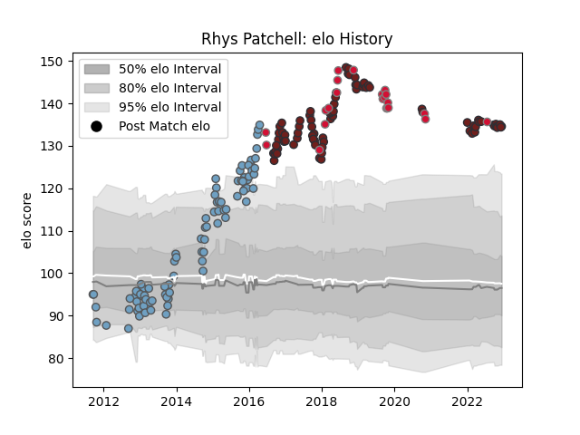

---  
layout: page  
title: Rhys Patchell  
date: 2022-12-09 13:09:45.181630  
categories: player  
---
# Rhys Patchell

## Positions: FH, FB

## Country: Wales

## Current elo: 134.0

## Current Percentile: 99.0

# Elo History

# Match History

| Team          |   Appearances |   Win Rate |
|:--------------|--------------:|-----------:|
| Cardiff Blues |            85 |   0.441176 |
| Scarlets      |            76 |   0.552632 |
| Wales         |            22 |   0.545455 |

| Opponent            |   Matches |   Win Rate |
|:--------------------|----------:|-----------:|
| Ulster              |        13 |  0.0769231 |
| Glasgow Warriors    |        13 |  0.461538  |
| Zebre               |        12 |  0.833333  |
| Connacht            |        12 |  0.541667  |
| Ospreys             |        12 |  0.416667  |
| Munster             |        11 |  0.363636  |
| Dragons             |        11 |  0.818182  |
| Leinster            |        10 |  0.2       |
| Edinburgh           |         8 |  0.75      |
| Benetton Treviso    |         8 |  0.5       |
| Scarlets            |         7 |  0.285714  |
| Toulon              |         6 |  0.5       |
| Cardiff Blues       |         5 |  0.8       |
| South Africa        |         4 |  0.5       |
| Montpellier Herault |         4 |  0.25      |
| New Zealand         |         3 |  0         |
| Southern Kings      |         2 |  1         |
| Scotland            |         2 |  0.5       |
| Sale Sharks         |         2 |  1         |
| Rovigo              |         2 |  1         |
| Stormers            |         2 |  0         |
| Argentina           |         2 |  1         |
| Ireland             |         2 |  0         |
| Bath Rugby          |         2 |  0.5       |
| Harlequins          |         2 |  0         |
| Grenoble            |         2 |  1         |
| France              |         2 |  0.5       |
| Calvisano           |         2 |  1         |
| Cheetahs            |         2 |  1         |
| Italy               |         1 |  1         |
| England             |         1 |  0         |
| Wasps               |         1 |  1         |
| Uruguay             |         1 |  1         |
| Bristol Rugby       |         1 |  0         |
| Tonga               |         1 |  1         |
| Bulls               |         1 |  0         |
| Fiji                |         1 |  1         |
| Exeter Chiefs       |         1 |  0         |
| Saracens            |         1 |  0         |
| Australia           |         1 |  1         |
| Georgia             |         1 |  1         |
| Newcastle Falcons   |         1 |  0         |
| Gloucester Rugby    |         1 |  0         |
| London Irish        |         1 |  1         |
| Lions               |         1 |  0         |
| Leicester Tigers    |         1 |  0         |
| La Rochelle         |         1 |  1         |