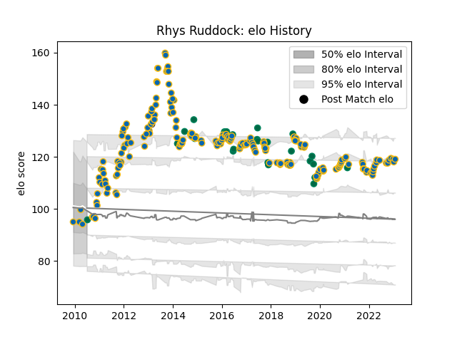

---  
layout: page  
title: Rhys Ruddock  
date: 2022-12-28 12:56:16.370112  
categories: player  
---
# Rhys Ruddock

## Positions: FL, N8

## Country: Ireland

## Current elo: 95.0

## Current Percentile: 16.0

# Elo History

# Match History

| Team      |   Appearances |   Win Rate |
|:----------|--------------:|-----------:|
| Leinster  |           207 |   0.789855 |
| Ireland   |            27 |   0.685185 |
| Edinburgh |             1 |   0        |

| Opponent                 |   Matches |   Win Rate |
|:-------------------------|----------:|-----------:|
| Ulster                   |        18 |   0.666667 |
| Ospreys                  |        18 |   0.722222 |
| Connacht                 |        17 |   0.823529 |
| Munster                  |        16 |   0.625    |
| Glasgow Warriors         |        15 |   0.866667 |
| Cardiff Blues            |        15 |   0.866667 |
| Scarlets                 |        15 |   0.766667 |
| Benetton Treviso         |        14 |   0.928571 |
| Dragons                  |        12 |   0.916667 |
| Zebre                    |         8 |   1        |
| Edinburgh                |         8 |   0.875    |
| Northampton Saints       |         6 |   0.833333 |
| Wasps                    |         5 |   0.8      |
| Bath Rugby               |         5 |   0.8      |
| South Africa             |         5 |   0.6      |
| Italy                    |         4 |   1        |
| Aironi                   |         4 |   1        |
| Japan                    |         3 |   0.666667 |
| Argentina                |         3 |   0.666667 |
| Toulon                   |         3 |   0        |
| Castres Olympique        |         3 |   1        |
| Saracens                 |         2 |   0.5      |
| Racing 92                |         2 |   1        |
| Australia                |         2 |   0.5      |
| Wales                    |         2 |   0.75     |
| United States of America |         2 |   1        |
| Stade Toulousain         |         2 |   0.5      |
| Bulls                    |         2 |   0.5      |
| Sharks                   |         2 |   0.5      |
| Lyon                     |         2 |   1        |
| Cheetahs                 |         2 |   0.5      |
| Montpellier Herault      |         2 |   1        |
| Exeter Chiefs            |         2 |   1        |
| Harlequins               |         2 |   0.5      |
| Russia                   |         1 |   1        |
| Fiji                     |         1 |   1        |
| Scotland                 |         1 |   1        |
| Clermont Auvergne        |         1 |   0        |
| New Zealand              |         1 |   0        |
| Southern Kings           |         1 |   1        |
| Stade Francais Paris     |         1 |   1        |
| England                  |         1 |   0        |
| Stormers                 |         1 |   0        |
| Biarritz Olympique       |         1 |   1        |
| Lions                    |         1 |   1        |
| France                   |         1 |   0        |