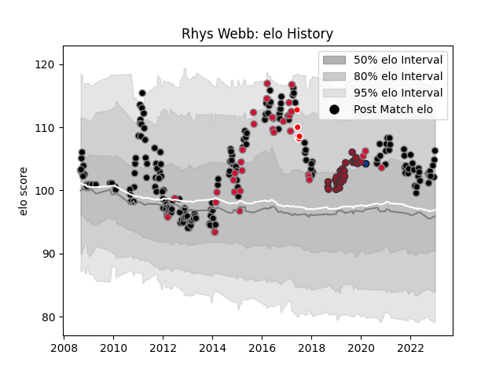

---  
layout: page  
title: Rhys Webb  
date: 2022-12-14 11:33:22.696523  
categories: player  
---
# Rhys Webb

## Positions: SH

## Country: Wales

## Current elo: 99.0

## Current Percentile: 69.0

# Elo History

# Match History

| Team                    |   Appearances |   Win Rate |
|:------------------------|--------------:|-----------:|
| Ospreys                 |           200 |   0.57     |
| Wales                   |            33 |   0.484848 |
| Toulon                  |            24 |   0.458333 |
| British and Irish Lions |             7 |   0.5      |
| Bath Rugby              |             1 |   0        |

| Opponent             |   Matches |   Win Rate |
|:---------------------|----------:|-----------:|
| Benetton Treviso     |        20 |   0.825    |
| Cardiff Blues        |        18 |   0.805556 |
| Dragons              |        17 |   0.558824 |
| Scarlets             |        16 |   0.5      |
| Connacht             |        13 |   0.769231 |
| Ulster               |        13 |   0.384615 |
| Munster              |        13 |   0.576923 |
| Leinster             |        13 |   0.384615 |
| Glasgow Warriors     |        10 |   0.4      |
| Edinburgh            |        10 |   0.6      |
| Zebre                |         8 |   1        |
| New Zealand          |         8 |   0.1875   |
| Italy                |         7 |   1        |
| England              |         6 |   0        |
| Leicester Tigers     |         5 |   0.3      |
| Stade Toulousain     |         5 |   0.5      |
| Newcastle Falcons    |         4 |   0.75     |
| Northampton Saints   |         4 |   0.25     |
| France               |         4 |   0.5      |
| Ireland              |         4 |   0.75     |
| Racing 92            |         4 |   0.125    |
| Saracens             |         3 |   0.166667 |
| Lyon                 |         3 |   0.333333 |
| Aironi               |         3 |   1        |
| Clermont Auvergne    |         3 |   0.333333 |
| Castres Olympique    |         3 |   0.666667 |
| Scotland             |         2 |   0.5      |
| Perpignan            |         2 |   1        |
| Pau                  |         2 |   0.5      |
| South Africa         |         2 |   1        |
| Stormers             |         2 |   0.25     |
| Australia            |         2 |   0        |
| Worcester Warriors   |         2 |   0.5      |
| Biarritz Olympique   |         2 |   0.5      |
| Montpellier Herault  |         2 |   0.25     |
| Agen                 |         2 |   0.5      |
| Bordeaux Begles      |         2 |   0.5      |
| Bulls                |         2 |   0        |
| Harlequins           |         2 |   0.5      |
| Bristol Rugby        |         2 |   0.5      |
| Lions                |         2 |   0        |
| Georgia              |         1 |   1        |
| Yorkshire Carnegie   |         1 |   1        |
| Crusaders            |         1 |   1        |
| Wasps                |         1 |   1        |
| Toulon               |         1 |   1        |
| Exeter Chiefs        |         1 |   0        |
| Stade Francais Paris |         1 |   0        |
| London Irish         |         1 |   0        |
| Sharks               |         1 |   0        |
| Bath Rugby           |         1 |   0        |
| Gloucester Rugby     |         1 |   1        |
| Grenoble             |         1 |   0        |
| Provincial Union XV  |         1 |   1        |
| Highlanders          |         1 |   0        |
| La Rochelle          |         1 |   0        |
| Blues                |         1 |   0        |
| Bayonne              |         1 |   1        |
| Cheetahs             |         1 |   0        |