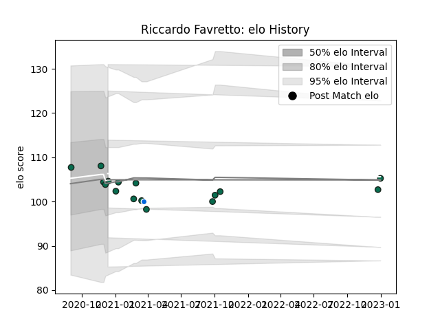

---  
layout: page  
title: Riccardo Favretto  
date: 2023-01-06 00:24:38.828887  
categories: player  
---
# Riccardo Favretto

## Positions: N8, L

## Country: Italy

## Current elo: 105.0

## Current Percentile: 48.0

# Elo History

# Match History

| Team             |   Appearances |   Win Rate |
|:-----------------|--------------:|-----------:|
| Benetton Treviso |            16 |      0.375 |
| Italy            |             1 |      0     |

| Opponent             |   Matches |   Win Rate |
|:---------------------|----------:|-----------:|
| Zebre                |         5 |        0.6 |
| Connacht             |         2 |        0   |
| Ospreys              |         2 |        0   |
| Cardiff Blues        |         1 |        0   |
| Dragons              |         1 |        0   |
| Edinburgh            |         1 |        1   |
| Glasgow Warriors     |         1 |        0   |
| Scarlets             |         1 |        0   |
| Scotland             |         1 |        0   |
| Stade Francais Paris |         1 |        1   |
| Stormers             |         1 |        1   |