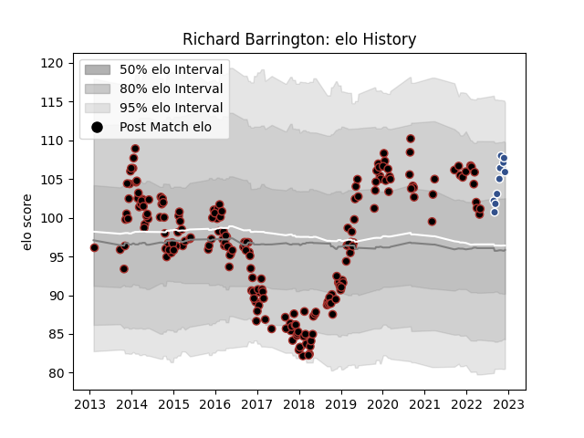

---  
layout: page  
title: Richard Barrington  
date: 2023-02-02 18:54:52.819123  
categories: player  
---
# Richard Barrington

## Positions: P

## Current elo: 101.0

## Current Percentile: 72.0

# Elo History

# Match History

| Team     |   Appearances |   Win Rate |
|:---------|--------------:|-----------:|
| Saracens |           209 |   0.755981 |
| Agen     |            14 |   0.642857 |

| Opponent            |   Matches |   Win Rate |
|:--------------------|----------:|-----------:|
| Northampton Saints  |        19 |   0.631579 |
| Sale Sharks         |        18 |   0.805556 |
| Exeter Chiefs       |        17 |   0.735294 |
| Leicester Tigers    |        16 |   0.71875  |
| Bath Rugby          |        14 |   0.714286 |
| Harlequins          |        14 |   0.714286 |
| Wasps               |        13 |   0.692308 |
| Newcastle Falcons   |        12 |   1        |
| Worcester Warriors  |        12 |   0.833333 |
| Gloucester Rugby    |        11 |   0.636364 |
| London Irish        |        10 |   0.85     |
| Bristol Rugby       |         5 |   0.8      |
| Munster             |         5 |   0.6      |
| Clermont Auvergne   |         5 |   0.4      |
| Ospreys             |         4 |   0.875    |
| Toulon              |         3 |   0.666667 |
| Leinster            |         3 |   0.666667 |
| Racing 92           |         3 |   0.666667 |
| Glasgow Warriors    |         3 |   1        |
| Scarlets            |         3 |   0.833333 |
| Stade Toulousain    |         2 |   0.5      |
| Vannes              |         2 |   1        |
| Oyonnax             |         2 |   0.5      |
| Ulster              |         2 |   1        |
| Rouen               |         2 |   1        |
| Zebre               |         2 |   1        |
| Biarritz Olympique  |         2 |   1        |
| Lyon                |         2 |   1        |
| Cardiff Blues       |         2 |   1        |
| Nevers              |         1 |   0        |
| Ealing Trailfinders |         1 |   1        |
| Brive               |         1 |   1        |
| Carcassonne         |         1 |   0        |
| Connacht            |         1 |   1        |
| Cornish Pirates     |         1 |   0        |
| Doncaster           |         1 |   1        |
| Grenoble            |         1 |   0        |
| Montauban           |         1 |   0        |
| Jersey              |         1 |   1        |
| Richmond            |         1 |   1        |
| London Welsh        |         1 |   1        |
| Provence Rugby      |         1 |   1        |
| Mont-de-Marsan      |         1 |   1        |
| Massy               |         1 |   1        |