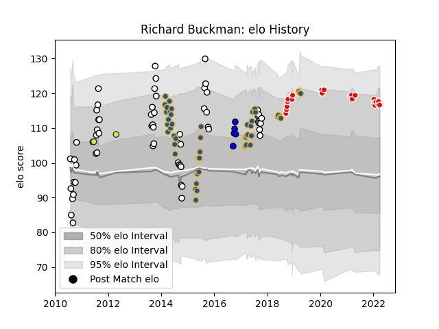

---  
layout: page  
title: Richard Buckman  
date: 2023-01-21 15:42:37.935704  
categories: player  
---
# Richard Buckman

## Positions: C, W

## Country: Highlanders

## Current elo: 109.0

## Current Percentile: 76.0

# Elo History

# Match History

| Team                  |   Appearances |   Win Rate |
|:----------------------|--------------:|-----------:|
| Hawke's Bay           |            57 |   0.587719 |
| Highlanders           |            48 |   0.583333 |
| Kobelco Kobe Steelers |            15 |   0.666667 |
| Saitama Wild Knights  |             5 |   0.8      |
| Hurricanes            |             4 |   0.375    |

| Opponent                          |   Matches |   Win Rate |
|:----------------------------------|----------:|-----------:|
| Crusaders                         |         8 |   0        |
| Hurricanes                        |         8 |   0.5      |
| Otago                             |         7 |   0.714286 |
| Blues                             |         7 |   0.714286 |
| Northland                         |         6 |   0.666667 |
| North Harbour                     |         6 |   0.666667 |
| Bay of Plenty                     |         6 |   0.5      |
| Chiefs                            |         6 |   0.583333 |
| Counties Manukau                  |         6 |   0.666667 |
| Wellington                        |         5 |   0.6      |
| Southland                         |         4 |   0.875    |
| Tasman                            |         4 |   0        |
| Manawatu                          |         4 |   0.75     |
| Taranaki                          |         4 |   0.5      |
| New South Wales Waratahs          |         3 |   0.666667 |
| Lions                             |         3 |   0.666667 |
| Yokohama Canon Eagles             |         3 |   0.666667 |
| Green Rockets Tokatsu             |         3 |   1        |
| Tokyo Sungoliath                  |         3 |   0.333333 |
| Western Force                     |         3 |   0.666667 |
| Queensland Reds                   |         3 |   0.666667 |
| Sharks                            |         2 |   1        |
| Toshiba Brave Lupus Tokyo         |         2 |   0.5      |
| Urayasu D-Rocks                   |         2 |   0.5      |
| Waikato                           |         2 |   0.25     |
| Melbourne Rebels                  |         2 |   1        |
| Kubota Spears Funabashi Tokyo-Bay |         2 |   0.5      |
| Canterbury                        |         2 |   0.25     |
| Bulls                             |         2 |   1        |
| Brumbies                          |         2 |   0.5      |
| Black Rams Tokyo                  |         2 |   1        |
| Shizuoka Blue Revs                |         1 |   1        |
| Stormers                          |         1 |   0        |
| Hino Red Dolphins                 |         1 |   1        |
| Coca-Cola Red Sparks              |         1 |   1        |
| Cheetahs                          |         1 |   1        |
| British and Irish Lions           |         1 |   1        |
| Auckland                          |         1 |   1        |