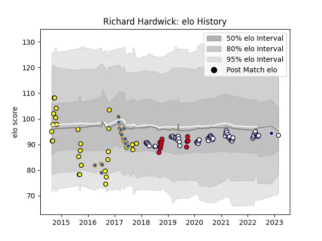

---  
layout: page  
title: Richard Hardwick  
date: 2022-11-22 11:39:49.380258  
categories: player  
---
# Richard Hardwick

## Positions: FL, N8

## Country: Namibia

## Current elo: 90.0

## Current Percentile: 25.0

# Elo History

# Match History

| Team             |   Appearances |   Win Rate |
|:-----------------|--------------:|-----------:|
| Melbourne Rebels |            58 |   0.37069  |
| Perth Spirit     |            21 |   0.47619  |
| Western Force    |            19 |   0.263158 |
| Melbourne Rising |            11 |   0.363636 |
| Australia        |             2 |   0.5      |
| Namibia          |             1 |   1        |

| Opponent                 |   Matches |   Win Rate |
|:-------------------------|----------:|-----------:|
| Brumbies                 |        11 |   0.363636 |
| Queensland Reds          |        10 |   0.35     |
| New South Wales Waratahs |        10 |   0.4      |
| Western Force            |         7 |   0.571429 |
| Highlanders              |         7 |   0.428571 |
| Brisbane City            |         5 |   0.2      |
| Melbourne Rising         |         5 |   0.8      |
| Sharks                   |         4 |   0.25     |
| Queensland Country       |         4 |   0.75     |
| Chiefs                   |         4 |   0        |
| Crusaders                |         4 |   0        |
| Hurricanes               |         4 |   0        |
| North Harbour Rays       |         3 |   0        |
| NSW Country Eagles       |         3 |   0.333333 |
| Blues                    |         3 |   0        |
| Fijian Drua              |         3 |   0.333333 |
| Canberra Vikings         |         3 |   0.333333 |
| Lions                    |         2 |   0.5      |
| Bulls                    |         2 |   0        |
| Sydney Stars             |         2 |   0.5      |
| Sydney Rays              |         2 |   1        |
| Sunwolves                |         2 |   0.5      |
| Stormers                 |         2 |   0        |
| Jaguares                 |         2 |   0.5      |
| Southern Kings           |         1 |   1        |
| Canada                   |         1 |   1        |
| Scotland                 |         1 |   0        |
| Cheetahs                 |         1 |   0        |
| Fiji                     |         1 |   1        |
| Moana Pasifika           |         1 |   1        |
| Greater Sydney Rams      |         1 |   1        |
| Melbourne Rebels         |         1 |   1        |