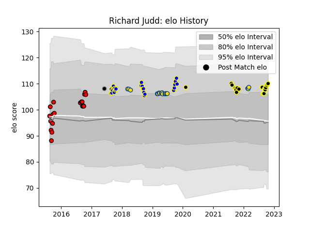

---  
layout: page  
title: Richard Judd  
date: 2023-03-21 18:48:15.900759  
categories: player  
---
# Richard Judd

Last updated: 2023-03-21
## Positions: SH

## Country: Provincial Union XV

## Current elo: 110.0

## Current Percentile: 81.0

# Elo History

# Match History

| Team                |   Appearances |   Win Rate |
|:--------------------|--------------:|-----------:|
| Bay of Plenty       |            24 |   0.604167 |
| Wellington          |            21 |   0.666667 |
| Counties Manukau    |            19 |   0.421053 |
| Hurricanes          |            17 |   0.823529 |
| Provincial Union XV |             1 |   0        |
| Tokyo Sungoliath    |             1 |   1        |

| Opponent                |   Matches |   Win Rate |
|:------------------------|----------:|-----------:|
| Hawke's Bay             |         9 |   0.666667 |
| Canterbury              |         7 |   0.428571 |
| Waikato                 |         6 |   0.666667 |
| Taranaki                |         6 |   0.5      |
| Manawatu                |         6 |   0.833333 |
| Otago                   |         5 |   0.8      |
| Northland               |         5 |   0.6      |
| Tasman                  |         4 |   0.5      |
| Crusaders               |         4 |   0.25     |
| Auckland                |         3 |   0.333333 |
| North Harbour           |         3 |   0        |
| Counties Manukau        |         3 |   0.833333 |
| Highlanders             |         3 |   1        |
| Bay of Plenty           |         3 |   0.333333 |
| Southland               |         2 |   1        |
| Wellington              |         2 |   0        |
| Chiefs                  |         2 |   1        |
| Melbourne Rebels        |         1 |   1        |
| Green Rockets Tokatsu   |         1 |   1        |
| Sharks                  |         1 |   1        |
| Bulls                   |         1 |   1        |
| Stormers                |         1 |   1        |
| Sunwolves               |         1 |   1        |
| Brumbies                |         1 |   1        |
| British and Irish Lions |         1 |   0        |
| Blues                   |         1 |   1        |
| Lions                   |         1 |   1        |