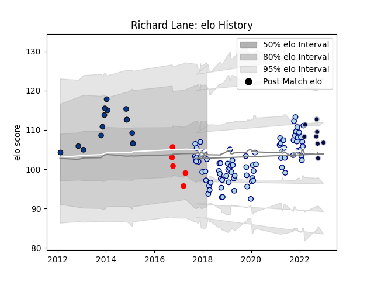

---  
layout: page  
title: Richard Lane  
date: 2023-02-02 18:56:24.033132  
categories: player  
---
# Richard Lane

## Positions: FB, W

## Current elo: 93.0

## Current Percentile: 6.0

# Elo History

# Match History

| Team          |   Appearances |   Win Rate |
|:--------------|--------------:|-----------:|
| Bedford       |            81 |   0.506173 |
| Bath Rugby    |            15 |   0.8      |
| Bristol Rugby |            10 |   0.5      |
| Jersey        |             5 |   0.4      |

| Opponent            |   Matches |   Win Rate |
|:--------------------|----------:|-----------:|
| Doncaster           |         9 |   0.5      |
| Hartpury College    |         8 |   0.75     |
| Richmond            |         8 |   0.75     |
| Cornish Pirates     |         8 |   0.25     |
| Jersey              |         8 |   0.5      |
| Ealing Trailfinders |         7 |   0.285714 |
| London Scottish     |         7 |   0.642857 |
| Coventry            |         6 |   0.333333 |
| Nottingham          |         6 |   0.666667 |
| Yorkshire Carnegie  |         5 |   0.6      |
| Saracens            |         4 |   0        |
| Ampthill            |         4 |   0.5      |
| Exeter Chiefs       |         4 |   0.5      |
| Harlequins          |         3 |   0.666667 |
| Newcastle Falcons   |         3 |   0.333333 |
| Dragons             |         3 |   1        |
| Rotherham Titans    |         3 |   1        |
| London Irish        |         3 |   0.333333 |
| London Welsh        |         2 |   0.5      |
| Mogliano            |         2 |   1        |
| Bristol Rugby       |         2 |   0        |
| Bath Rugby          |         1 |   1        |
| Ospreys             |         1 |   0        |
| Perpignan           |         1 |   1        |
| Cardiff Blues       |         1 |   1        |
| Sale Sharks         |         1 |   1        |
| Wasps               |         1 |   1        |