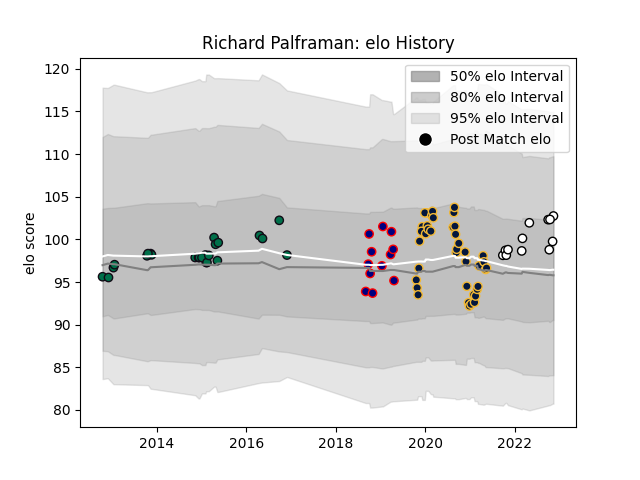

---  
layout: page  
title: Richard Palframan  
date: 2022-11-16 11:37:27.217381  
categories: player  
---
# Richard Palframan

## Positions: P

## Current elo: 102.0

## Current Percentile: 65.0

# Elo History

# Match History

| Team               |   Appearances |   Win Rate |
|:-------------------|--------------:|-----------:|
| Worcester Warriors |            41 |   0.268293 |
| London Irish       |            24 |   0.4375   |
| London Scottish    |            12 |   0.416667 |
| Newcastle Falcons  |            12 |   0.416667 |

| Opponent            |   Matches |   Win Rate |
|:--------------------|----------:|-----------:|
| Bath Rugby          |         7 |  0.142857  |
| Wasps               |         7 |  0.0714286 |
| Bristol Rugby       |         6 |  0.333333  |
| Northampton Saints  |         6 |  0         |
| Exeter Chiefs       |         6 |  0.166667  |
| Sale Sharks         |         5 |  0.4       |
| London Irish        |         5 |  0.6       |
| Gloucester Rugby    |         5 |  0.2       |
| Harlequins          |         5 |  0.4       |
| Saracens            |         4 |  0.25      |
| Leicester Tigers    |         3 |  0.333333  |
| Hartpury College    |         2 |  0.5       |
| RC Enisei           |         2 |  1         |
| Newcastle Falcons   |         2 |  0         |
| Jersey              |         2 |  1         |
| Ealing Trailfinders |         2 |  0.5       |
| Dragons             |         2 |  0.5       |
| Doncaster           |         2 |  0         |
| Cardiff Blues       |         2 |  0.5       |
| Bordeaux Begles     |         2 |  1         |
| Yorkshire Carnegie  |         2 |  0.5       |
| Bedford             |         1 |  1         |
| London Welsh        |         1 |  1         |
| Lusitanos XV        |         1 |  1         |
| Mont-de-Marsan      |         1 |  1         |
| Cornish Pirates     |         1 |  1         |
| Ospreys             |         1 |  0         |
| Cavalieri Prato     |         1 |  1         |
| Richmond            |         1 |  0         |
| Castres Olympique   |         1 |  0         |
| Scarlets            |         1 |  0         |