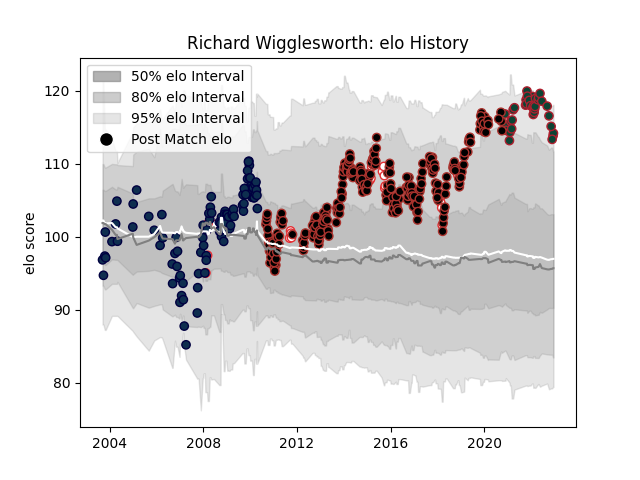

---  
layout: page  
title: Richard Wigglesworth  
date: 2022-12-14 11:30:16.849539  
categories: player  
---
# Richard Wigglesworth

## Positions: SH

## Country: England

## Current elo: 114.0

## Current Percentile: 91.0

# Elo History

# Match History

| Team             |   Appearances |   Win Rate |
|:-----------------|--------------:|-----------:|
| Saracens         |           247 |   0.771255 |
| Sale Sharks      |           102 |   0.495098 |
| Leicester Tigers |            34 |   0.705882 |
| England          |            26 |   0.615385 |

| Opponent           |   Matches |   Win Rate |
|:-------------------|----------:|-----------:|
| Bath Rugby         |        30 |   0.616667 |
| Northampton Saints |        29 |   0.724138 |
| Harlequins         |        28 |   0.785714 |
| Gloucester Rugby   |        28 |   0.678571 |
| London Irish       |        27 |   0.592593 |
| Wasps              |        25 |   0.84     |
| Leicester Tigers   |        23 |   0.673913 |
| Newcastle Falcons  |        22 |   0.795455 |
| Exeter Chiefs      |        22 |   0.613636 |
| Worcester Warriors |        20 |   0.65     |
| Sale Sharks        |        20 |   0.7      |
| Bristol Rugby      |        11 |   0.727273 |
| Clermont Auvergne  |        11 |   0.454545 |
| Munster            |         9 |   0.555556 |
| Saracens           |         8 |   0.375    |
| Racing 92          |         8 |   0.75     |
| Yorkshire Carnegie |         6 |   0.833333 |
| Ospreys            |         5 |   0.9      |
| Stade Toulousain   |         5 |   0.2      |
| Leinster           |         5 |   0.4      |
| Cardiff Blues      |         5 |   0.6      |
| France             |         5 |   0.6      |
| Scotland           |         4 |   0.5      |
| Wales              |         4 |   0.5      |
| Toulon             |         4 |   0.5      |
| London Welsh       |         4 |   1        |
| Leeds              |         4 |   1        |
| Ulster             |         4 |   1        |
| Ireland            |         3 |   0.333333 |
| Glasgow Warriors   |         3 |   1        |
| Connacht           |         3 |   1        |
| Scarlets           |         2 |   0.75     |
| Lyon               |         2 |   1        |
| Zebre              |         2 |   1        |
| Oyonnax            |         2 |   1        |
| Montauban          |         2 |   0.5      |
| Australia          |         2 |   0.5      |
| Italy              |         2 |   1        |
| Edinburgh          |         2 |   1        |
| Rotherham Titans   |         1 |   1        |
| Romania            |         1 |   1        |
| New Zealand        |         1 |   0        |
| Japan              |         1 |   1        |
| Uruguay            |         1 |   1        |
| Fiji               |         1 |   1        |
| Dragons            |         1 |   0        |
| Argentina          |         1 |   1        |