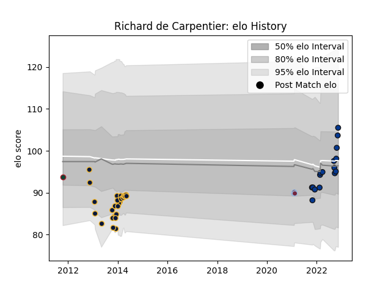

---  
layout: page  
title: Richard de Carpentier  
date: 2022-11-15 23:40:40.155006  
categories: player  
---
# Richard de Carpentier

## Positions: FL, N8

## Current elo: 106.0

## Current Percentile: 74.0

# Elo History

# Match History

| Team               |   Appearances |   Win Rate |
|:-------------------|--------------:|-----------:|
| Worcester Warriors |            28 |   0.160714 |
| Bath Rugby         |            16 |   0.28125  |
| Harlequins         |             3 |   1        |
| Leicester Tigers   |             1 |   0        |

| Opponent           |   Matches |   Win Rate |
|:-------------------|----------:|-----------:|
| Sale Sharks        |         7 |  0.0714286 |
| Wasps              |         6 |  0.166667  |
| Leicester Tigers   |         5 |  0.4       |
| Northampton Saints |         4 |  0.25      |
| Saracens           |         4 |  0         |
| Exeter Chiefs      |         3 |  0         |
| Gloucester Rugby   |         3 |  0.333333  |
| Newcastle Falcons  |         3 |  1         |
| Bath Rugby         |         2 |  0.5       |
| Biarritz Olympique |         2 |  0         |
| London Irish       |         2 |  0         |
| Oyonnax            |         2 |  0.75      |
| Scarlets           |         2 |  0.5       |
| Bristol Rugby      |         1 |  0         |
| Harlequins         |         1 |  0         |
| London Welsh       |         1 |  0         |