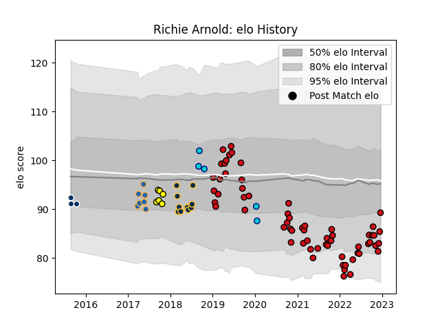

---  
layout: page  
title: Richie Arnold  
date: 2023-02-02 18:53:25.148976  
categories: player  
---
# Richie Arnold

## Positions: L

## Current elo: 94.0

## Current Percentile: 54.0

# Elo History

# Match History

| Team               |   Appearances |   Win Rate |
|:-------------------|--------------:|-----------:|
| Stade Toulousain   |            71 |   0.633803 |
| Brumbies           |            10 |   0.6      |
| Western Force      |             7 |   0.428571 |
| Perth Spirit       |             6 |   0.666667 |
| Shizuoka Blue Revs |             5 |   0.8      |
| Queensland Country |             4 |   0        |

| Opponent                          |   Matches |   Win Rate |
|:----------------------------------|----------:|-----------:|
| La Rochelle                       |         8 |   0.75     |
| Racing 92                         |         7 |   0.714286 |
| Castres Olympique                 |         7 |   0.642857 |
| Lyon                              |         6 |   0.166667 |
| Clermont Auvergne                 |         6 |   0.833333 |
| Pau                               |         5 |   0.6      |
| Stade Francais Paris              |         4 |   0.375    |
| Toulon                            |         4 |   0.75     |
| Brive                             |         4 |   0.75     |
| Perpignan                         |         3 |   0.666667 |
| Montpellier Herault               |         3 |   0.666667 |
| Sunwolves                         |         2 |   1        |
| Munster                           |         2 |   1        |
| Brisbane City                     |         2 |   0.5      |
| Melbourne Rising                  |         2 |   0.5      |
| Sale Sharks                       |         2 |   1        |
| Bordeaux Begles                   |         2 |   0.5      |
| Queensland Reds                   |         2 |   0.5      |
| New South Wales Waratahs          |         2 |   0.5      |
| Leinster                          |         2 |   0        |
| Hurricanes                        |         2 |   0.5      |
| Agen                              |         1 |   1        |
| Queensland Country                |         1 |   1        |
| Southern Kings                    |         1 |   1        |
| Sydney Rays                       |         1 |   0        |
| Sydney Stars                      |         1 |   0        |
| Toyota Verblitz                   |         1 |   1        |
| Sharks                            |         1 |   1        |
| Kubota Spears Funabashi Tokyo-Bay |         1 |   1        |
| Melbourne Rebels                  |         1 |   0        |
| Bath Rugby                        |         1 |   1        |
| Bayonne                           |         1 |   0        |
| Biarritz Olympique                |         1 |   1        |
| Black Rams Tokyo                  |         1 |   1        |
| Blues                             |         1 |   0        |
| Bulls                             |         1 |   1        |
| Canberra Vikings                  |         1 |   0        |
| Chiefs                            |         1 |   0        |
| Coca-Cola Red Sparks              |         1 |   1        |
| Crusaders                         |         1 |   0        |
| Fijian Drua                       |         1 |   0        |
| Greater Sydney Rams               |         1 |   1        |
| Grenoble                          |         1 |   1        |
| Highlanders                       |         1 |   0        |
| Jaguares                          |         1 |   1        |
| Kobelco Kobe Steelers             |         1 |   0        |
| Wasps                             |         1 |   0        |