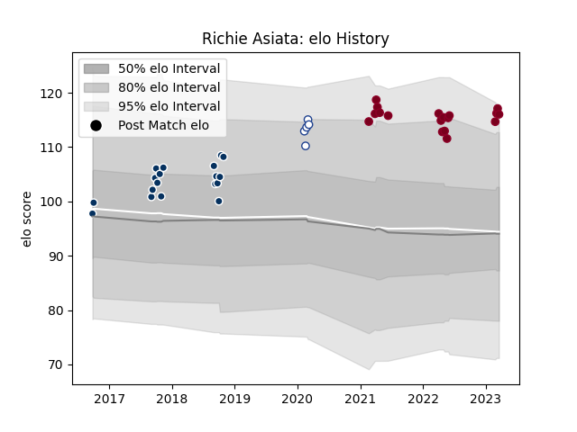

---  
layout: page  
title: Richie Asiata  
date: 2023-03-02 11:21:31.049773  
categories: player  
---
# Richie Asiata

## Positions: P, H

## Current elo: 115.0

## Current Percentile: 90.0

# Elo History

# Match History

| Team               |   Appearances |   Win Rate |
|:-------------------|--------------:|-----------:|
| Queensland Country |            18 |   0.666667 |
| Queensland Reds    |            15 |   0.466667 |
| Toronto Arrows     |             5 |   0.8      |

| Opponent                 |   Matches |   Win Rate |
|:-------------------------|----------:|-----------:|
| Hurricanes               |         3 |   0        |
| Canberra Vikings         |         3 |   0.666667 |
| NSW Country Eagles       |         3 |   1        |
| Fijian Drua              |         3 |   0.666667 |
| Brisbane City            |         2 |   0.5      |
| Sydney Rays              |         2 |   1        |
| New South Wales Waratahs |         2 |   1        |
| Melbourne Rising         |         2 |   1        |
| Melbourne Rebels         |         2 |   1        |
| Western Force            |         2 |   0        |
| Crusaders                |         2 |   0        |
| Brumbies                 |         2 |   1        |
| Houston SaberCats        |         1 |   1        |
| Highlanders              |         1 |   0        |
| Greater Sydney Rams      |         1 |   0        |
| Moana Pasifika           |         1 |   1        |
| Colorado Raptors         |         1 |   0        |
| Chiefs                   |         1 |   0        |
| Perth Spirit             |         1 |   0        |
| Rugby ATL                |         1 |   1        |
| Seattle Seawolves        |         1 |   1        |
| Austin Herd              |         1 |   1        |