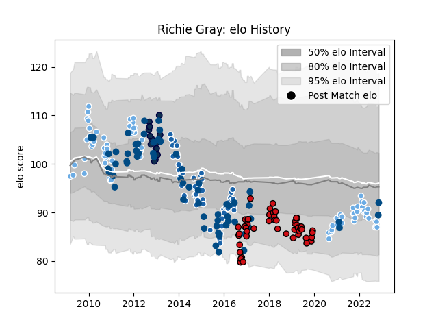

---  
layout: page  
title: Richie Gray  
date: 2023-02-02 18:44:14.314498  
categories: player  
---
# Richie Gray

## Positions: L

## Country: Scotland

## Current elo: 97.0

## Current Percentile: 59.0

# Elo History

# Match History

| Team                    |   Appearances |   Win Rate |
|:------------------------|--------------:|-----------:|
| Glasgow Warriors        |            88 |   0.494318 |
| Scotland                |            65 |   0.446154 |
| Castres Olympique       |            61 |   0.409836 |
| Stade Toulousain        |            50 |   0.66     |
| Sale Sharks             |            16 |   0.1875   |
| British and Irish Lions |             1 |   1        |

| Opponent                 |   Matches |   Win Rate |
|:-------------------------|----------:|-----------:|
| Edinburgh                |        15 |  0.566667  |
| Leinster                 |        13 |  0.0769231 |
| Montpellier Herault      |        12 |  0.625     |
| Racing 92                |        10 |  0.6       |
| Connacht                 |        10 |  0.65      |
| Clermont Auvergne        |         8 |  0.4375    |
| La Rochelle              |         8 |  0.625     |
| Wales                    |         8 |  0.125     |
| France                   |         8 |  0.125     |
| Stade Francais Paris     |         7 |  0.714286  |
| Italy                    |         7 |  0.857143  |
| Ireland                  |         7 |  0.428571  |
| Ospreys                  |         7 |  0.5       |
| Grenoble                 |         7 |  0.571429  |
| England                  |         7 |  0.142857  |
| Bordeaux Begles          |         7 |  0.571429  |
| Cardiff Blues            |         7 |  0.428571  |
| Toulon                   |         7 |  0.285714  |
| Ulster                   |         6 |  0.333333  |
| Lyon                     |         5 |  0.2       |
| Benetton Treviso         |         5 |  0.6       |
| Dragons                  |         5 |  0.6       |
| Munster                  |         5 |  0.2       |
| Stade Toulousain         |         5 |  0.2       |
| Pau                      |         4 |  0.5       |
| Brive                    |         4 |  0.5       |
| Perpignan                |         4 |  0.75      |
| Japan                    |         4 |  1         |
| Bayonne                  |         4 |  0.75      |
| South Africa             |         4 |  0.25      |
| Bath Rugby               |         4 |  0.625     |
| Scarlets                 |         4 |  0.5       |
| New Zealand              |         4 |  0         |
| Wasps                    |         4 |  0.25      |
| Castres Olympique        |         4 |  0.25      |
| Oyonnax                  |         3 |  1         |
| Northampton Saints       |         3 |  0.333333  |
| Zebre                    |         3 |  1         |
| Harlequins               |         3 |  0         |
| Gloucester Rugby         |         3 |  0.666667  |
| Samoa                    |         3 |  1         |
| Australia                |         3 |  0.333333  |
| Sharks                   |         2 |  0.5       |
| Tonga                    |         2 |  0.5       |
| Saracens                 |         2 |  0         |
| Agen                     |         2 |  1         |
| London Welsh             |         2 |  0.5       |
| Georgia                  |         2 |  1         |
| Fiji                     |         2 |  1         |
| Bulls                    |         2 |  0.5       |
| Biarritz Olympique       |         2 |  0.25      |
| Argentina                |         2 |  0.5       |
| Leicester Tigers         |         2 |  0         |
| Romania                  |         1 |  1         |
| Lions                    |         1 |  1         |
| Aironi                   |         1 |  1         |
| Stormers                 |         1 |  0         |
| Exeter Chiefs            |         1 |  0         |
| Canada                   |         1 |  1         |
| United States of America |         1 |  1         |
| Worcester Warriors       |         1 |  1         |