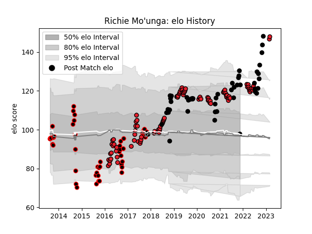

---  
layout: page  
title: Richie Mo'unga  
date: 2022-11-22 11:29:16.460319  
categories: player  
---
# Richie Mo'unga

## Positions: FH

## Country: New Zealand

## Current elo: 132.0

## Current Percentile: 97.0

# Elo History

# Match History

| Team        |   Appearances |   Win Rate |
|:------------|--------------:|-----------:|
| Crusaders   |            94 |   0.856383 |
| Canterbury  |            48 |   0.8125   |
| New Zealand |            45 |   0.744444 |

| Opponent                 |   Matches |   Win Rate |
|:-------------------------|----------:|-----------:|
| Chiefs                   |        16 |   0.6875   |
| Hurricanes               |        13 |   0.769231 |
| Highlanders              |        12 |   0.833333 |
| Blues                    |        12 |   0.916667 |
| Australia                |        11 |   0.863636 |
| Tasman                   |         7 |   0.714286 |
| Auckland                 |         7 |   0.857143 |
| Argentina                |         6 |   0.666667 |
| South Africa             |         6 |   0.583333 |
| Melbourne Rebels         |         6 |   1        |
| Taranaki                 |         5 |   0.6      |
| Queensland Reds          |         5 |   1        |
| North Harbour            |         5 |   0.8      |
| Ireland                  |         5 |   0.4      |
| Lions                    |         5 |   0.8      |
| Counties Manukau         |         5 |   1        |
| Brumbies                 |         5 |   1        |
| Otago                    |         4 |   1        |
| New South Wales Waratahs |         4 |   1        |
| England                  |         3 |   0.5      |
| Wales                    |         3 |   1        |
| Waikato                  |         3 |   1        |
| Stormers                 |         3 |   0.833333 |
| Southland                |         3 |   0.666667 |
| France                   |         3 |   0.666667 |
| Hawke's Bay              |         2 |   1        |
| Wellington               |         2 |   0.5      |
| Sharks                   |         2 |   1        |
| Bulls                    |         2 |   1        |
| Northland                |         2 |   1        |
| Manawatu                 |         2 |   0.5      |
| Japan                    |         2 |   1        |
| Jaguares                 |         2 |   1        |
| Italy                    |         2 |   1        |
| Western Force            |         2 |   1        |
| Canada                   |         1 |   1        |
| Moana Pasifika           |         1 |   1        |
| Cheetahs                 |         1 |   1        |
| Southern Kings           |         1 |   1        |
| Sunwolves                |         1 |   1        |
| British and Irish Lions  |         1 |   0        |
| Bay of Plenty            |         1 |   1        |
| Tonga                    |         1 |   1        |
| United States of America |         1 |   1        |
| Fiji                     |         1 |   1        |