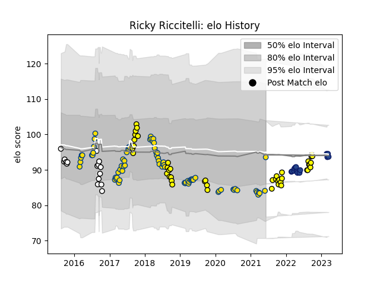

---  
layout: page  
title: Ricky Riccitelli  
date: 2023-03-17 17:22:56.270530  
categories: player  
---
# Ricky Riccitelli

## Positions: H

## Country: Hurricanes

## Current elo: 94.0

## Current Percentile: 17.0

# Elo History

# Match History

| Team        |   Appearances |   Win Rate |
|:------------|--------------:|-----------:|
| Hurricanes  |            73 |   0.691781 |
| Taranaki    |            43 |   0.534884 |
| Hawke's Bay |            17 |   0.470588 |
| Blues       |            13 |   0.846154 |

| Opponent                 |   Matches |   Win Rate |
|:-------------------------|----------:|-----------:|
| Crusaders                |        11 |   0.454545 |
| Chiefs                   |        11 |   0.636364 |
| Highlanders              |        10 |   0.7      |
| Blues                    |         8 |   0.75     |
| Brumbies                 |         8 |   0.5      |
| Bay of Plenty            |         8 |   0.5      |
| Auckland                 |         6 |   0.333333 |
| Wellington               |         6 |   0.333333 |
| Waikato                  |         6 |   0.166667 |
| Tasman                   |         5 |   0.2      |
| Manawatu                 |         5 |   1        |
| Western Force            |         4 |   1        |
| Counties Manukau         |         4 |   0.75     |
| Canterbury               |         4 |   0.5      |
| Sunwolves                |         4 |   1        |
| Lions                    |         4 |   0.75     |
| Southland                |         4 |   1        |
| New South Wales Waratahs |         4 |   1        |
| Northland                |         3 |   0.666667 |
| Stormers                 |         3 |   0.666667 |
| Hawke's Bay              |         3 |   0.666667 |
| Otago                    |         3 |   1        |
| Melbourne Rebels         |         3 |   1        |
| Jaguares                 |         3 |   0.666667 |
| North Harbour            |         2 |   0        |
| Queensland Reds          |         2 |   1        |
| Sharks                   |         2 |   1        |
| Hurricanes               |         2 |   0.5      |
| Bulls                    |         2 |   0.5      |
| Moana Pasifika           |         1 |   1        |
| Southern Kings           |         1 |   1        |
| Cheetahs                 |         1 |   1        |
| Taranaki                 |         1 |   0        |
| British and Irish Lions  |         1 |   0.5      |
| Fijian Drua              |         1 |   1        |