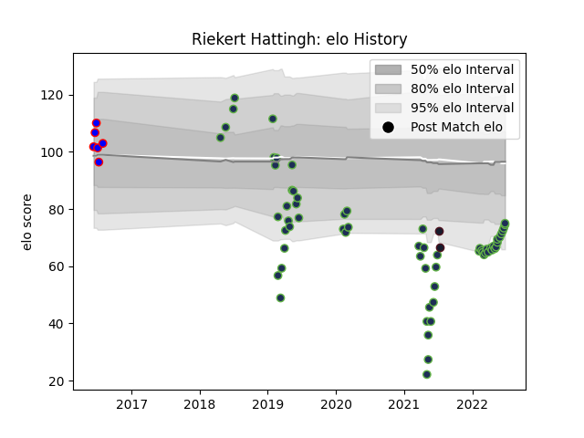

---  
layout: page  
title: Riekert Hattingh  
date: 2023-03-21 18:24:25.983485  
categories: player  
---
# Riekert Hattingh

Last updated: 2023-03-21
## Positions: N8

## Country: United States of America

## Current elo: 75.0

## Current Percentile: 8.0

# Elo History

# Match History

| Team                     |   Appearances |   Win Rate |
|:-------------------------|--------------:|-----------:|
| Seattle Seawolves        |            64 |    0.53125 |
| Ohio                     |             6 |    1       |
| United States of America |             2 |    0       |

| Opponent               |   Matches |   Win Rate |
|:-----------------------|----------:|-----------:|
| San Diego Legion       |        11 |   0.727273 |
| Utah Warriors          |         7 |   0.714286 |
| Toronto Arrows         |         6 |   0.5      |
| Houston SaberCats      |         6 |   0.666667 |
| Rugby New York         |         5 |   0.4      |
| R.U. New York          |         5 |   0.4      |
| Austin Gilgronis       |         4 |   0        |
| L. A. Giltinis         |         4 |   0.25     |
| NOLA Gold              |         3 |   0.333333 |
| New England Free Jacks |         3 |   0.333333 |
| Glendale Raptors       |         3 |   1        |
| Old Glory DC           |         2 |   0        |
| San Diego              |         2 |   1        |
| Denver                 |         2 |   1        |
| Dallas Jackals         |         2 |   1        |
| Austin Elite Rugby     |         2 |   1        |
| Ireland                |         1 |   0        |
| Rugby ATL              |         1 |   0        |
| England                |         1 |   0        |
| Sacramento             |         1 |   1        |
| San Francisco          |         1 |   1        |