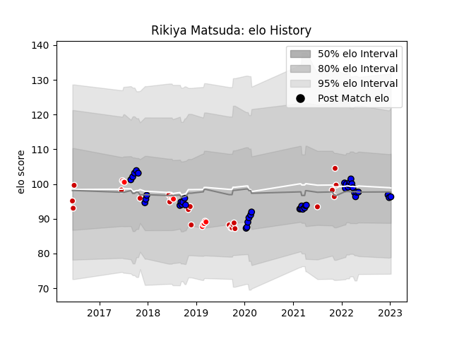

---  
layout: page  
title: Rikiya Matsuda  
date: 2023-03-21 18:20:17.137292  
categories: player  
---
# Rikiya Matsuda

Last updated: 2023-03-21
## Positions: FH, C

## Country: Japan

## Current elo: 103.0

## Current Percentile: 66.0

# Elo History

# Match History

| Team                 |   Appearances |   Win Rate |
|:---------------------|--------------:|-----------:|
| Saitama Wild Knights |            54 |   0.916667 |
| Japan                |            23 |   0.391304 |
| Sunwolves            |            10 |   0.2      |

| Opponent                          |   Matches |   Win Rate |
|:----------------------------------|----------:|-----------:|
| Yokohama Canon Eagles             |         6 |   1        |
| Toyota Verblitz                   |         6 |   0.833333 |
| Black Rams Tokyo                  |         5 |   0.8      |
| Toshiba Brave Lupus Tokyo         |         5 |   1        |
| Ireland                           |         5 |   0.2      |
| Urayasu D-Rocks                   |         4 |   0.75     |
| Tokyo Sungoliath                  |         4 |   0.75     |
| Shizuoka Blue Revs                |         4 |   1        |
| Scotland                          |         4 |   0.25     |
| Kobelco Kobe Steelers             |         4 |   0.875    |
| Kubota Spears Funabashi Tokyo-Bay |         4 |   1        |
| NTT Docomo Red Hurricanes Osaka   |         3 |   1        |
| South Africa                      |         2 |   0        |
| Russia                            |         2 |   1        |
| Queensland Reds                   |         2 |   0        |
| New South Wales Waratahs          |         2 |   0        |
| Australia                         |         2 |   0        |
| Italy                             |         2 |   0.5      |
| Coca-Cola Red Sparks              |         2 |   1        |
| Mie Honda Heat                    |         1 |   1        |
| Sharks                            |         1 |   0        |
| Blues                             |         1 |   0        |
| Bulls                             |         1 |   1        |
| Toyota Industries Shuttles Aichi  |         1 |   1        |
| Canada                            |         1 |   1        |
| Chiefs                            |         1 |   1        |
| Stormers                          |         1 |   0        |
| England                           |         1 |   0        |
| Georgia                           |         1 |   1        |
| Mitsubishi Dynaboars              |         1 |   1        |
| Samoa                             |         1 |   1        |
| Green Rockets Tokatsu             |         1 |   1        |
| Hanazono Kintetsu Liners          |         1 |   1        |
| Portugal                          |         1 |   1        |
| New Zealand                       |         1 |   0        |
| Hino Red Dolphins                 |         1 |   1        |
| Lions                             |         1 |   0        |
| Munakata Sanix Blues              |         1 |   1        |