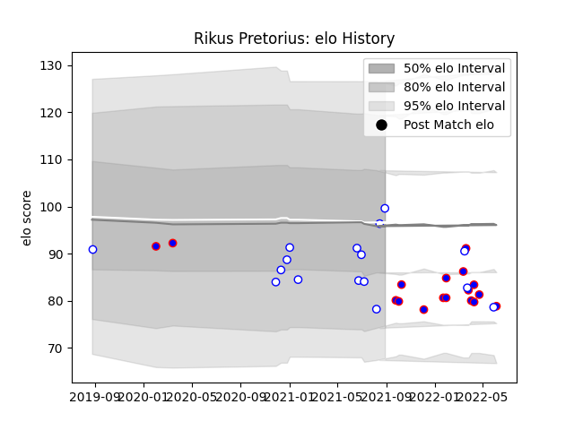

---  
layout: page  
title: Rikus Pretorius  
date: 2023-03-17 17:17:42.223269  
categories: player  
---
# Rikus Pretorius

## Positions: C

## Current elo: 100.0

## Current Percentile: 13.0

# Elo History

# Match History

| Team             |   Appearances |   Win Rate |
|:-----------------|--------------:|-----------:|
| Stormers         |            17 |   0.676471 |
| Western Province |            16 |   0.46875  |

| Opponent            |   Matches |   Win Rate |
|:--------------------|----------:|-----------:|
| Free State Cheetahs |         4 |   0.5      |
| Natal Sharks        |         3 |   0.666667 |
| Bulls               |         3 |   1        |
| Sharks              |         3 |   0.333333 |
| Pumas               |         3 |   0.5      |
| Edinburgh           |         2 |   0.75     |
| Golden Lions        |         2 |   0        |
| Griquas             |         2 |   0.5      |
| Blue Bulls          |         2 |   0.5      |
| Benetton Treviso    |         1 |   0        |
| Ulster              |         1 |   1        |
| Ospreys             |         1 |   1        |
| Hurricanes          |         1 |   1        |
| Munster             |         1 |   0        |
| Lions               |         1 |   0        |
| Glasgow Warriors    |         1 |   1        |
| Cardiff Blues       |         1 |   1        |
| Zebre               |         1 |   1        |