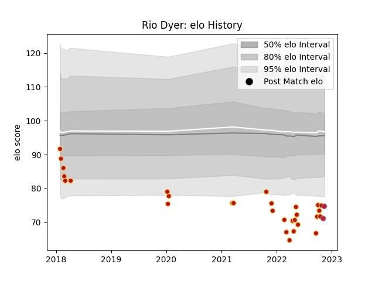

---  
layout: page  
title: Rio Dyer  
date: 2023-03-17 17:31:54.249934  
categories: player  
---
# Rio Dyer

## Positions: W

## Country: Wales

## Current elo: 68.0

## Current Percentile: 2.0

# Elo History

# Match History

| Team    |   Appearances |   Win Rate |
|:--------|--------------:|-----------:|
| Dragons |            40 |   0.225    |
| Wales   |             6 |   0.333333 |

| Opponent               |   Matches |   Win Rate |
|:-----------------------|----------:|-----------:|
| Benetton Treviso       |         4 |   0        |
| Cardiff Blues          |         4 |   0        |
| Edinburgh              |         3 |   0        |
| Ospreys                |         3 |   0.666667 |
| Scarlets               |         3 |   0.333333 |
| Munster                |         2 |   0.5      |
| Lions                  |         2 |   0        |
| Glasgow Warriors       |         2 |   0.5      |
| Ulster                 |         2 |   0        |
| Bulls                  |         2 |   0        |
| Pau                    |         2 |   0.5      |
| Southern Kings         |         1 |   0        |
| Perpignan              |         1 |   0        |
| Sharks                 |         1 |   0        |
| Scotland               |         1 |   0        |
| Saracens               |         1 |   0        |
| RC Enisei              |         1 |   1        |
| Worcester Warriors     |         1 |   1        |
| Argentina              |         1 |   1        |
| New Zealand            |         1 |   0        |
| Australia              |         1 |   0        |
| Lyon                   |         1 |   0        |
| Italy                  |         1 |   1        |
| Ireland                |         1 |   0        |
| Enisey-STM Krasnoyarsk |         1 |   1        |
| Castres Olympique      |         1 |   0        |
| Bordeaux Begles        |         1 |   0        |
| Zebre                  |         1 |   0        |