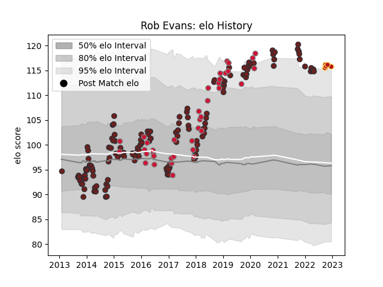

---  
layout: page  
title: Rob Evans  
date: 2022-12-18 16:32:45.569467  
categories: player  
---
# Rob Evans

## Positions: P

## Country: Wales

## Current elo: 116.0

## Current Percentile: 95.0

# Elo History

# Match History

| Team     |   Appearances |   Win Rate |
|:---------|--------------:|-----------:|
| Scarlets |           145 |   0.558621 |
| Wales    |            38 |   0.592105 |
| Dragons  |             5 |   0.4      |

| Opponent           |   Matches |   Win Rate |
|:-------------------|----------:|-----------:|
| Zebre              |        12 |   0.958333 |
| Ospreys            |        12 |   0.416667 |
| Benetton Treviso   |        12 |   0.916667 |
| Ulster             |        11 |   0.409091 |
| Edinburgh          |        11 |   0.409091 |
| Glasgow Warriors   |        10 |   0.4      |
| Leinster           |        10 |   0.3      |
| Dragons            |        10 |   0.8      |
| Cardiff Blues      |        10 |   0.4      |
| Munster            |         8 |   0.4375   |
| Toulon             |         7 |   0.285714 |
| Connacht           |         6 |   1        |
| England            |         6 |   0.166667 |
| Ireland            |         6 |   0.583333 |
| Scotland           |         5 |   0.8      |
| France             |         5 |   0.6      |
| Italy              |         5 |   1        |
| Racing 92          |         4 |   0.375    |
| New Zealand        |         4 |   0        |
| London Irish       |         3 |   0.666667 |
| Leicester Tigers   |         3 |   0.666667 |
| Australia          |         2 |   0.5      |
| Clermont Auvergne  |         2 |   0        |
| Bayonne            |         2 |   1        |
| South Africa       |         2 |   1        |
| Saracens           |         2 |   0.25     |
| Cheetahs           |         2 |   1        |
| Sale Sharks        |         2 |   0        |
| Harlequins         |         2 |   0.5      |
| Argentina          |         2 |   1        |
| Pau                |         1 |   0        |
| Northampton Saints |         1 |   0        |
| Lions              |         1 |   1        |
| Gloucester Rugby   |         1 |   1        |
| Bulls              |         1 |   0        |
| Sharks             |         1 |   0        |
| Southern Kings     |         1 |   1        |
| Tonga              |         1 |   1        |
| La Rochelle        |         1 |   1        |
| Bath Rugby         |         1 |   1        |