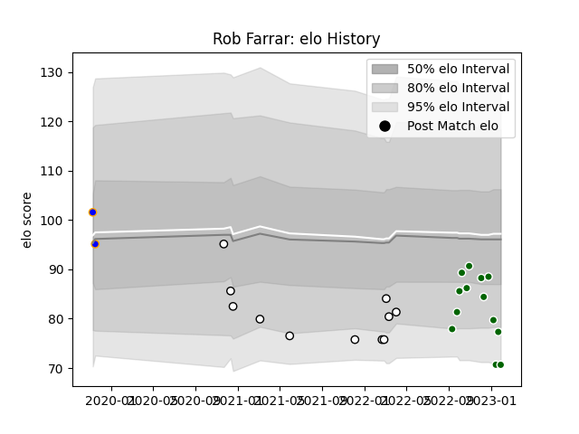

---  
layout: page  
title: Rob Farrar  
date: 2023-02-02 18:53:38.431979  
categories: player  
---
# Rob Farrar

## Positions: FL, L

## Current elo: 71.0

## Current Percentile: 8.0

# Elo History

# Match History

| Team                |   Appearances |   Win Rate |
|:--------------------|--------------:|-----------:|
| Ealing Trailfinders |            13 |   0.846154 |
| Newcastle Falcons   |            11 |   0.272727 |
| Doncaster           |             2 |   0        |

| Opponent            |   Matches |   Win Rate |
|:--------------------|----------:|-----------:|
| Coventry            |         3 |   0.333333 |
| Exeter Chiefs       |         2 |   0        |
| Hartpury College    |         2 |   1        |
| Bath Rugby          |         2 |   0.5      |
| Saracens            |         1 |   0        |
| Sale Sharks         |         1 |   0        |
| Richmond            |         1 |   1        |
| Nottingham          |         1 |   1        |
| London Scottish     |         1 |   1        |
| London Irish        |         1 |   0        |
| Jersey              |         1 |   1        |
| Ampthill            |         1 |   1        |
| Harlequins          |         1 |   0        |
| Ealing Trailfinders |         1 |   0        |
| Doncaster           |         1 |   1        |
| Cornish Pirates     |         1 |   1        |
| Castres Olympique   |         1 |   1        |
| Cardiff Blues       |         1 |   0        |
| Caldy               |         1 |   0        |
| Bedford             |         1 |   1        |
| Worcester Warriors  |         1 |   1        |