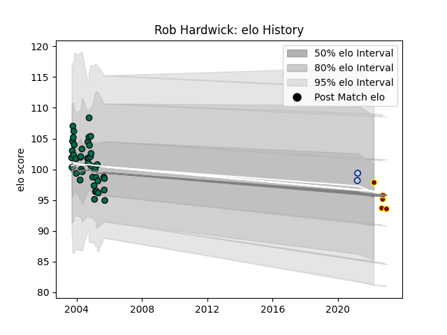

---  
layout: page  
title: Rob Hardwick  
date: 2023-02-02 18:48:09.856491  
categories: player  
---
# Rob Hardwick

## Positions: P

## Current elo: 96.0

## Current Percentile: None

# Elo History

# Match History

| Team         |   Appearances |   Win Rate |
|:-------------|--------------:|-----------:|
| London Irish |            42 |   0.440476 |
| Ampthill     |             7 |   0.285714 |
| Bedford      |             2 |   0.5      |

| Opponent            |   Matches |   Win Rate |
|:--------------------|----------:|-----------:|
| Bath Rugby          |         4 |   0        |
| Harlequins          |         4 |   0.625    |
| Wasps               |         4 |   0        |
| Saracens            |         4 |   0.75     |
| Sale Sharks         |         4 |   0.5      |
| Leeds               |         4 |   0.5      |
| Gloucester Rugby    |         4 |   0.25     |
| Leicester Tigers    |         3 |   0        |
| Newcastle Falcons   |         3 |   0.666667 |
| Northampton Saints  |         3 |   0.666667 |
| London Scottish     |         2 |   1        |
| Rotherham Titans    |         2 |   1        |
| Ealing Trailfinders |         2 |   0        |
| Cornish Pirates     |         2 |   0        |
| Worcester Warriors  |         2 |   0.5      |
| Hartpury College    |         1 |   1        |
| Jersey              |         1 |   0        |
| Bedford             |         1 |   0        |
| Bristol Rugby       |         1 |   1        |