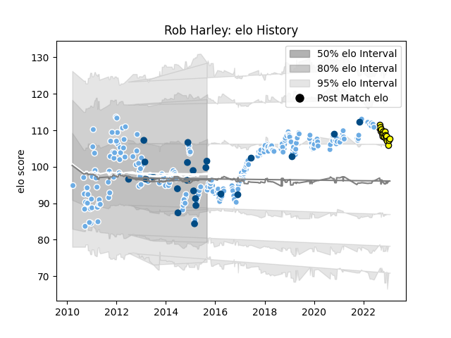

---  
layout: page  
title: Rob Harley  
date: 2022-12-09 13:12:46.387733  
categories: player  
---
# Rob Harley

## Positions: FL, L

## Country: Scotland

## Current elo: 113.0

## Current Percentile: 91.0

# Elo History

# Match History

| Team             |   Appearances |   Win Rate |
|:-----------------|--------------:|-----------:|
| Glasgow Warriors |           256 |   0.558594 |
| Scotland         |            19 |   0.473684 |
| Carcassonne      |            13 |   0.384615 |

| Opponent            |   Matches |   Win Rate |
|:--------------------|----------:|-----------:|
| Leinster            |        30 |   0.266667 |
| Edinburgh           |        24 |   0.5625   |
| Munster             |        22 |   0.363636 |
| Dragons             |        20 |   0.65     |
| Ulster              |        19 |   0.315789 |
| Cardiff Blues       |        19 |   0.736842 |
| Scarlets            |        17 |   0.411765 |
| Connacht            |        17 |   0.735294 |
| Zebre               |        14 |   1        |
| Ospreys             |        14 |   0.75     |
| Benetton Treviso    |        14 |   0.714286 |
| Exeter Chiefs       |         6 |   0.583333 |
| Saracens            |         4 |   0        |
| Ireland             |         4 |   0.25     |
| Stade Toulousain    |         4 |   0        |
| Cheetahs            |         4 |   1        |
| Bath Rugby          |         3 |   0.666667 |
| Italy               |         3 |   0.666667 |
| Southern Kings      |         3 |   0.666667 |
| Tonga               |         2 |   1        |
| Lyon                |         2 |   1        |
| Sale Sharks         |         2 |   1        |
| Argentina           |         2 |   1        |
| Wasps               |         2 |   0.5      |
| Wales               |         2 |   0        |
| Montpellier Herault |         2 |   1        |
| Aironi              |         2 |   1        |
| Leicester Tigers    |         2 |   1        |
| La Rochelle         |         2 |   0.5      |
| Castres Olympique   |         2 |   0        |
| Georgia             |         2 |   1        |
| Racing 92           |         2 |   1        |
| Stormers            |         1 |   0        |
| Vannes              |         1 |   0        |
| South Africa        |         1 |   0        |
| Soyaux-Angouleme    |         1 |   0        |
| Rouen               |         1 |   1        |
| Agen                |         1 |   1        |
| Provence Rugby      |         1 |   0        |
| Oyonnax             |         1 |   0        |
| Northampton Saints  |         1 |   0        |
| New Zealand         |         1 |   0        |
| Montauban           |         1 |   1        |
| Massy               |         1 |   0        |
| Grenoble            |         1 |   0        |
| France              |         1 |   0        |
| England             |         1 |   0        |
| Colomiers           |         1 |   0        |
| Bulls               |         1 |   0        |
| Biarritz Olympique  |         1 |   0        |
| Beziers             |         1 |   1        |
| Aurillac            |         1 |   1        |
| Lions               |         1 |   1        |