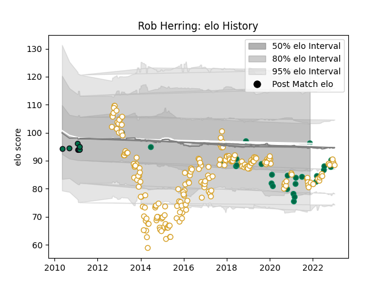

---  
layout: page  
title: Rob Herring  
date: 2023-02-02 18:42:27.865498  
categories: player  
---
# Rob Herring

## Positions: H

## Country: Ireland

## Current elo: 96.0

## Current Percentile: 13.0

# Elo History

# Match History

| Team         |   Appearances |   Win Rate |
|:-------------|--------------:|-----------:|
| Ulster       |           219 |   0.664384 |
| Ireland      |            28 |   0.821429 |
| London Irish |             9 |   0.333333 |
| Munster      |             1 |   1        |

| Opponent                 |   Matches |   Win Rate |
|:-------------------------|----------:|-----------:|
| Leinster                 |        22 |   0.272727 |
| Benetton Treviso         |        19 |   0.894737 |
| Munster                  |        19 |   0.473684 |
| Glasgow Warriors         |        17 |   0.529412 |
| Scarlets                 |        16 |   0.71875  |
| Connacht                 |        15 |   0.8      |
| Edinburgh                |        15 |   0.733333 |
| Zebre                    |        13 |   0.923077 |
| Ospreys                  |        12 |   0.833333 |
| Dragons                  |        11 |   0.818182 |
| Cardiff Blues            |        10 |   0.75     |
| Leicester Tigers         |         5 |   0.8      |
| Harlequins               |         5 |   1        |
| Clermont Auvergne        |         4 |   0.5      |
| Southern Kings           |         4 |   1        |
| Saracens                 |         4 |   0        |
| Italy                    |         4 |   1        |
| Australia                |         4 |   0.75     |
| La Rochelle              |         4 |   0.25     |
| Stade Toulousain         |         3 |   0.666667 |
| Scotland                 |         3 |   1        |
| Bath Rugby               |         3 |   0.666667 |
| New Zealand              |         3 |   1        |
| England                  |         3 |   0.666667 |
| Fiji                     |         2 |   1        |
| Castres Olympique        |         2 |   1        |
| Stormers                 |         2 |   0        |
| Toulon                   |         2 |   0        |
| France                   |         2 |   0        |
| Sale Sharks              |         2 |   0.5      |
| Oyonnax                  |         2 |   1        |
| Gloucester Rugby         |         2 |   0        |
| Northampton Saints       |         2 |   0.5      |
| Wales                    |         2 |   0.5      |
| Cheetahs                 |         2 |   0.75     |
| Wasps                    |         2 |   0.5      |
| Lions                    |         2 |   1        |
| South Africa             |         2 |   1        |
| United States of America |         1 |   1        |
| Yorkshire Carnegie       |         1 |   0        |
| Leeds                    |         1 |   0        |
| Sharks                   |         1 |   1        |
| Exeter Chiefs            |         1 |   1        |
| Japan                    |         1 |   1        |
| Racing 92                |         1 |   1        |
| Newcastle Falcons        |         1 |   1        |
| Bordeaux Begles          |         1 |   0        |
| Montpellier Herault      |         1 |   1        |
| Argentina                |         1 |   1        |