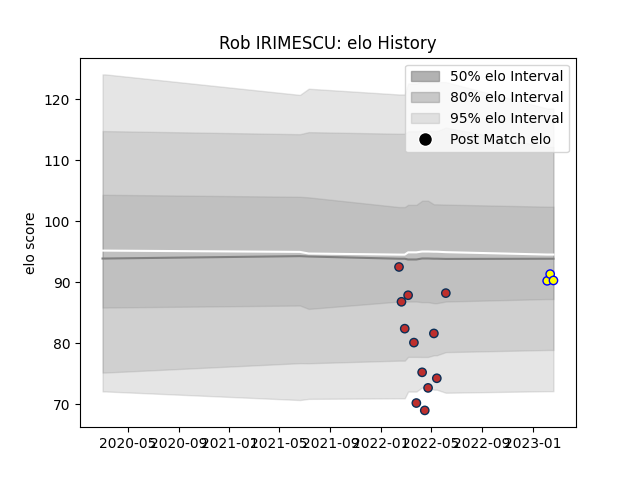

---  
layout: page  
title: Rob IRIMESCU  
date: 2023-02-16 11:19:47.615732  
categories: player  
---
# Rob IRIMESCU

## Positions: H

## Country: Romania

## Current elo: 103.0

## Current Percentile: 62.0

# Elo History

# Match History

| Team          |   Appearances |   Win Rate |
|:--------------|--------------:|-----------:|
| Old Glory DC  |            12 |       0.25 |
| R.U. New York |             4 |       0.5  |
| Romania       |             2 |       1    |

| Opponent               |   Matches |   Win Rate |
|:-----------------------|----------:|-----------:|
| Toronto Arrows         |         3 |   0.333333 |
| Houston SaberCats      |         2 |   1        |
| NOLA Gold              |         2 |   0        |
| New England Free Jacks |         2 |   0        |
| San Diego Legion       |         2 |   0        |
| Utah Warriors          |         2 |   0.5      |
| Austin Gilgronis       |         1 |   0        |
| Belgium                |         1 |   1        |
| Dallas Jackals         |         1 |   1        |
| Poland                 |         1 |   1        |
| Rugby ATL              |         1 |   0        |