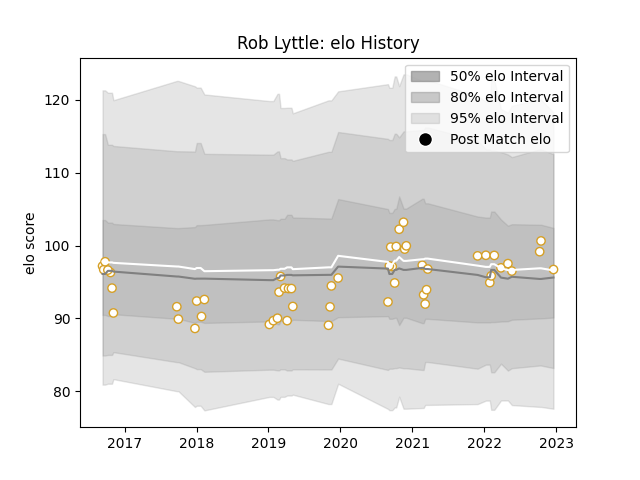

---  
layout: page  
title: Rob Lyttle  
date: 2023-01-15 11:41:37.921053  
categories: player  
---
# Rob Lyttle

## Positions: W

## Current elo: 122.0

## Current Percentile: 87.0

# Elo History

# Match History

| Team   |   Appearances |   Win Rate |
|:-------|--------------:|-----------:|
| Ulster |            55 |   0.645455 |

| Opponent         |   Matches |   Win Rate |
|:-----------------|----------:|-----------:|
| Leinster         |         7 |   0.285714 |
| Zebre            |         5 |   0.8      |
| Connacht         |         5 |   0.6      |
| Dragons          |         5 |   1        |
| Edinburgh        |         5 |   0.8      |
| Munster          |         4 |   0.25     |
| Ospreys          |         4 |   1        |
| Glasgow Warriors |         3 |   0.666667 |
| Benetton Treviso |         3 |   0.833333 |
| Scarlets         |         3 |   1        |
| La Rochelle      |         2 |   0        |
| Southern Kings   |         2 |   1        |
| Stade Toulousain |         1 |   0        |
| Wasps            |         1 |   0        |
| Stormers         |         1 |   0        |
| Bath Rugby       |         1 |   1        |
| Sharks           |         1 |   1        |
| Bordeaux Begles  |         1 |   0        |
| Lions            |         1 |   1        |